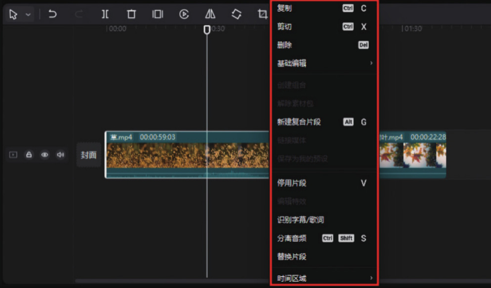
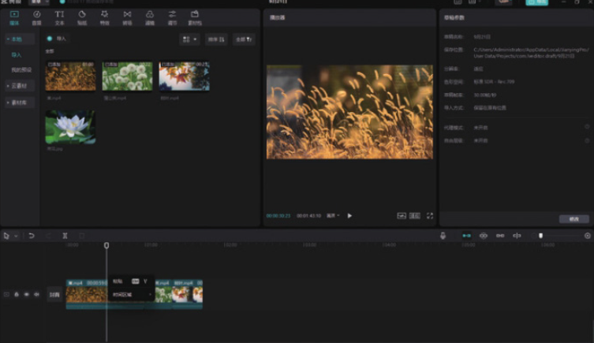
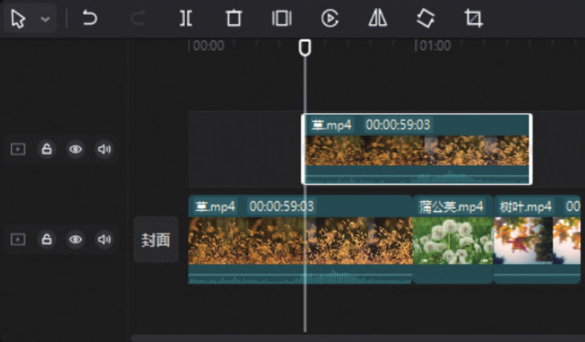
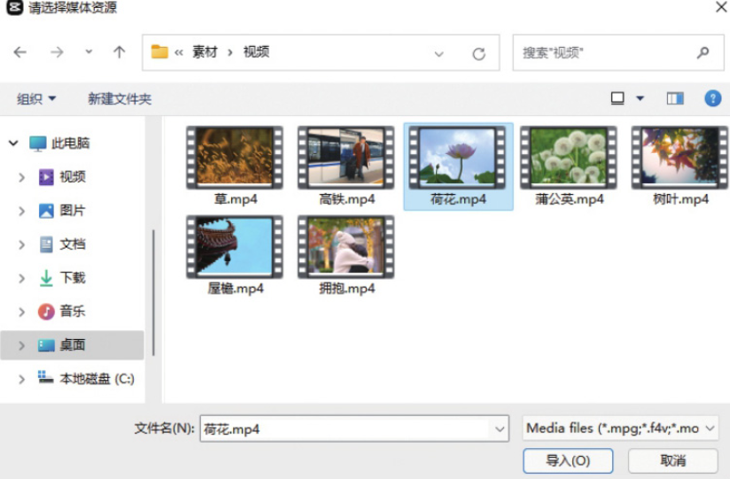
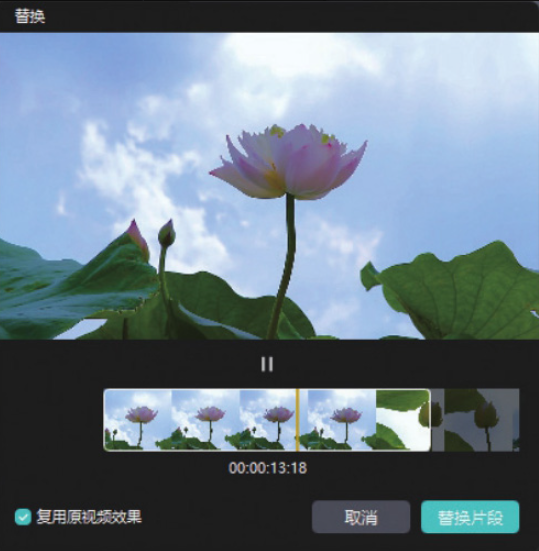
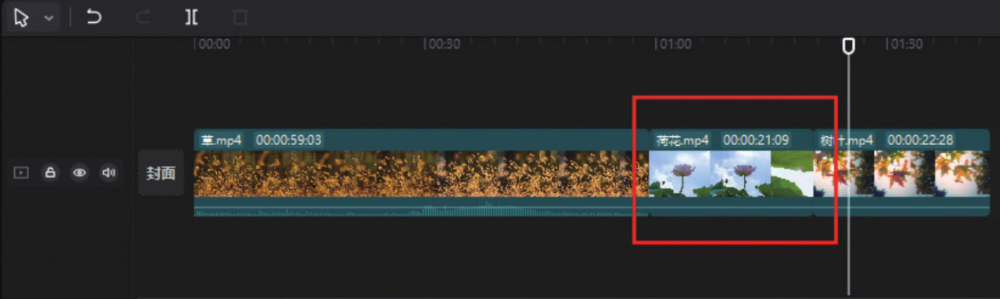

在剪映 App 中，​“复制”和“替换”功能都可以直接在底部工具栏中找到，但是在剪映专业版的常用功能区找不到这两个选项，那么在使用剪映专业版进行剪辑时，如果用户需要使用“复制”和“替换”功能，该如何操作呢？

在剪映专业版中，无论是对素材进行复制还是替换，首先都需要在时间轴中选中需要复制或替换的素材，然后单击鼠标右键，时间轴中会浮现出一个弹窗，如图 2-82 所示，可以看到其中包含“复制”和“替换片段”功能。



如果需要复制素材，可以直接选择“复制”选项，再单击鼠标右键，在界面浮现的弹窗中选择“粘贴”选项，即可在时间轴中复制出一段同样的素材，如图 2-83 和图 2-84 所示。




如果需要替换素材，可以直接选择“替换片段”选项，然后在打开的“请选择媒体资源”对话框中打开素材所在的文件夹，选择需要导入的视频文件，单击“导入”按钮，如图 2-85 所示，再在弹出的“替换”对话框中单击“替换片段”按钮，如图 2-86 所示。




执行上述操作后，选中的素材会被替换成新的素材，如图 2-87 所示。



```
除了上述复制素材的方法外，用户还可以在选中素材后按快捷键Ctrl+C和Ctrl+V来复制粘贴素材。在剪映专业版中，部分操作可以直接使用快捷键完成，这样可以提高剪辑效率。本书的附录对剪映专业版的快捷键进行了总结，大家可以对照学习。
```
