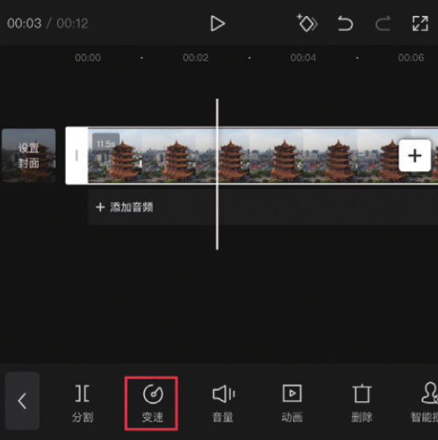
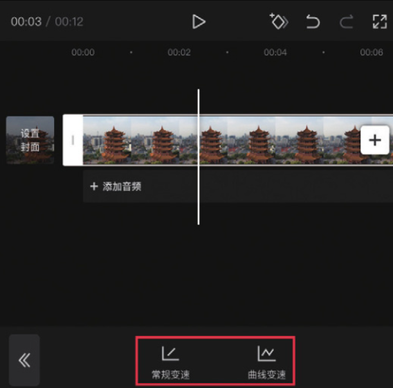
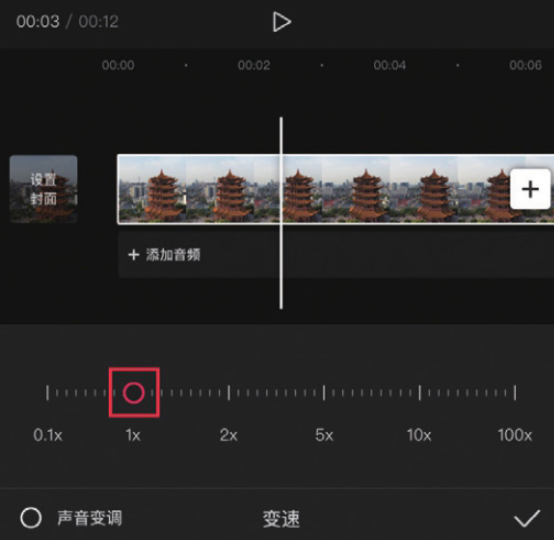
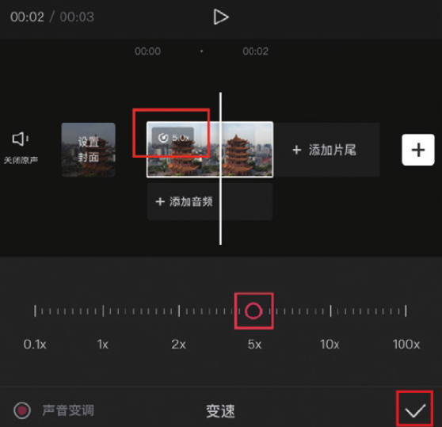

剪映中的“常规变速”功能可以对所选视频素材进行统一调速。在时间轴中选中需要进行变速处理的视频素材，点击底部工具栏中的“变速”按钮，如图 3-1 所示。此时可以看到底部工具栏中有两个变速选项，如图 3-2 所示。




点击“常规变速”按钮，可打开对应的变速选项栏，如图 3-3 所示。

一般情况下，视频素材的原始速度为 1x，拖动变速按钮可以调整视频的播放速度。当数值大于 1x 时，视频的播放速度将变快；当数值小于 1x 时，视频的播放速度将变慢。



当用户拖动变速按钮时，视频素材的左上角会显示倍速，如图 3-4 所示。完成变速调整后，点击右下角的按钮即可保存。



```
需要注意的是，当用户对素材进行常规变速操作时，素材的长度会相应地发生变化。简单来说，当倍速数值增加时，视频的播放速度会变快，素材的持续时间会变短；当倍速数值减小时，视频的播放速度会变慢，素材的持续时间会变长。
```
