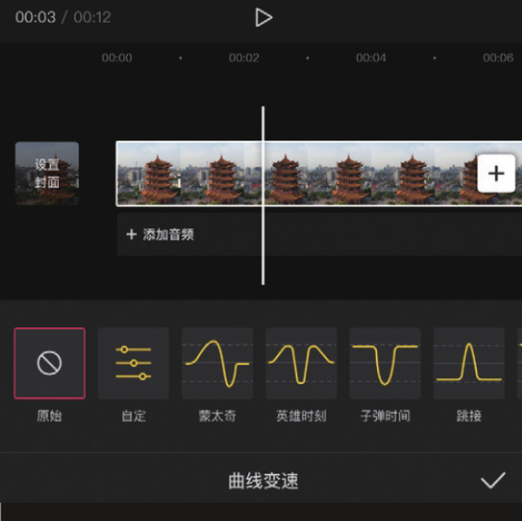
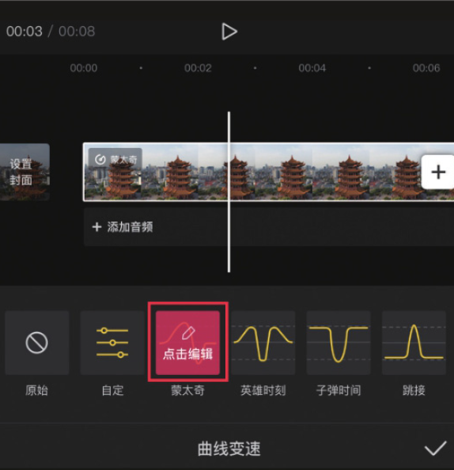
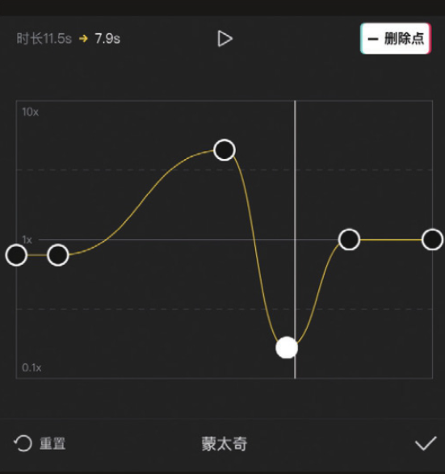

剪映中的“曲线变速”功能可以有针对性地对一段视频中的不同部分进行加速或减速处理，而加速、减速的幅度可以自由控制。

在变速选项栏中点击“曲线变速”按钮，可以看到“曲线变速”选项栏中罗列了不同的变速曲线选项，包括“原始”​“自定”​“蒙太奇”​“英雄时刻”​“子弹时间”​“跳接”等，如图 3-5 所示。

在“曲线变速”选项栏中，点击除“原始”选项外的任意一个变速曲线选项，都可以实时预览变速效果。下面以“蒙太奇”选项为例进行说明。

首次点击该选项按钮，预览区将自动展示变速效果，此时可以看到“蒙太奇”选项按钮显示为红色状态，如图 3-6 所示。再次点击该选项按钮，进入曲线编辑面板，如图 3-7 所示，在这里可以看到曲线的起伏状态，左上角显示了应用该速度曲线后素材的时长变化。

此外，用户可以对曲线上的各个锚点进行调整，以满足不同的播放速度要求。
