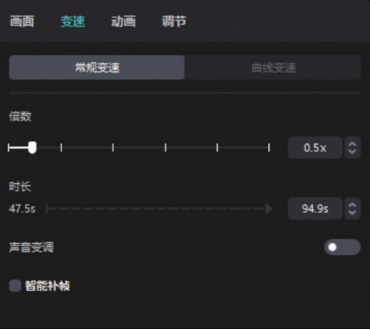
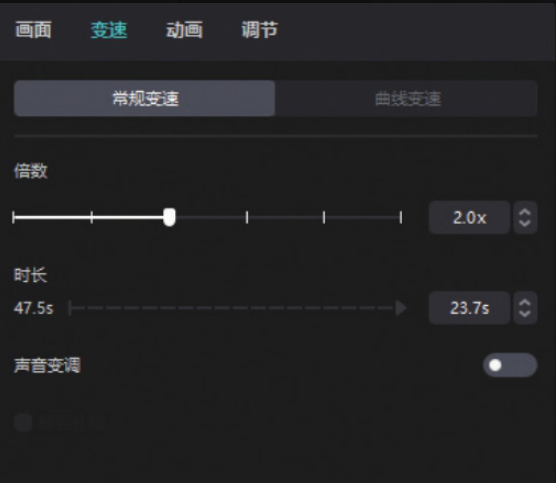
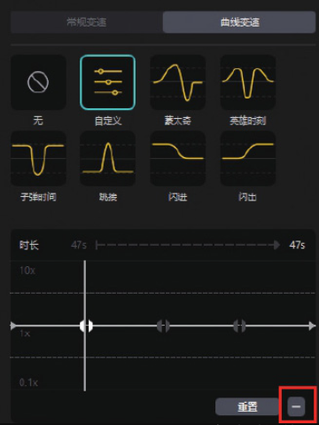
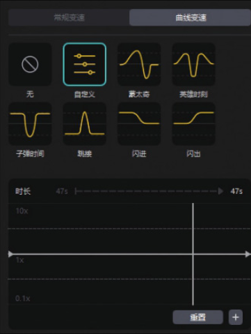
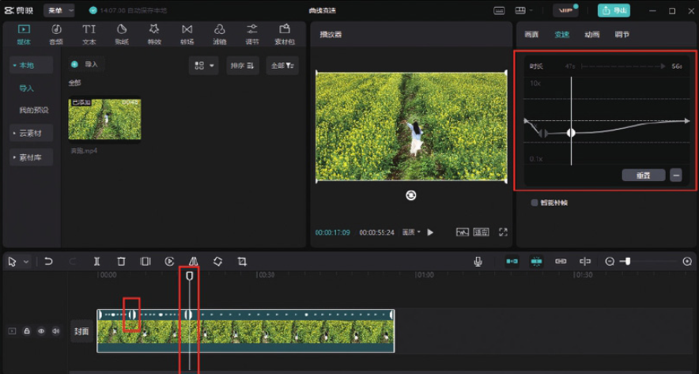
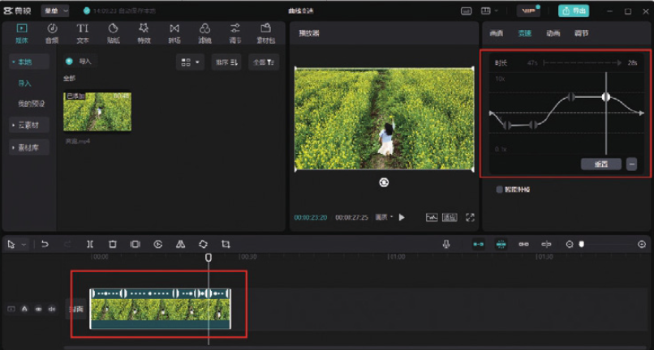
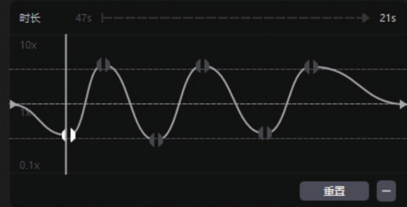

剪映专业版中的“变速”功能位于素材调整区，和剪映 App 一样，剪映专业版中的“变速”功能也包含“常规变速”和“曲线变速”两个选项。

在时间轴中选中需要进行变速处理的视频片段，在素材调整区单击切换至“变速”功能区，可以看到有“常规变速”和“曲线变速”两个选项。在默认的“常规变速”功能区，可以通过拖曳滑块控制加速或减速的幅度。1x 为原始速度，0.5x 为 1/2 慢速，如图 3-8 所示，0.2x 为 1/5 慢速，以此类推，即可确定慢动作的速度。而 2x 为 2 倍快速，如图 3-9 所示，剪映最高可以实现 100x 的快速。

当单击切换至“曲线变速”功能区后，用户可以为视频中的不同部分添加慢动作或快动作效果，但大多数情况下都需要单击“自定义”按钮，根据视频的不同情况进行手动设置。单击“自定义”按钮后，会出现一个曲线编辑面板，如图 3-10 所示。

由于需要根据视频内容自行确定锚点的位置，因此并不需要预设锚点。选中锚点后，单击“删除点”按钮，将其删除，删除后的界面如图 3-11 所示。

拖动时间线，将其定格在慢动作画面开始的位置，单击“添加点”按钮，并向下拖动锚点；再将时间线拖动至慢动作画面结束的位置，单击“添加点”按钮，同样向下拖动锚点，从而形成一段持续性的慢动作画面，如图 3-12 所示。

按照这个思路，在需要添加快动作效果的区域也添加两个锚点，并向上拖动，从而形成一段持续性的快动作画面，如图 3-13 所示。

如果不需要形成持续性的快动作或慢动作画面，而是让画面在快动作与慢动作之间不断变化，则可以让锚点在高位及低位交替出现，如图 3-14 所示。

