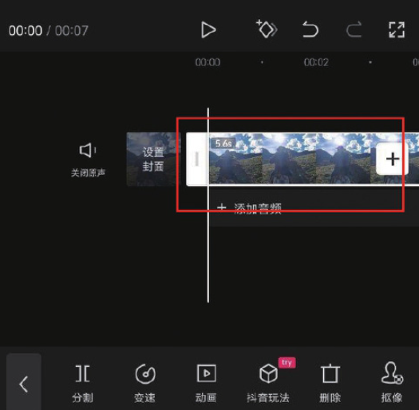
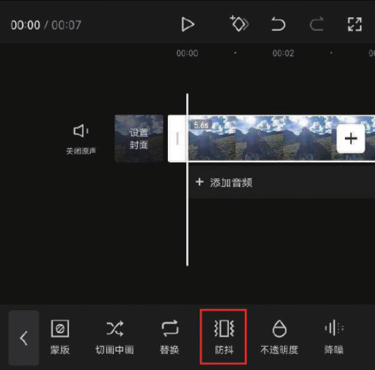

如果用手拿着相机或者手机拍视频，通常无法避免抖动的现象，这种抖动会影响整体视频的美观度，所以在后期剪辑时，可以使用剪映的“防抖”功能缓解画面的抖动，从而提升视频的质量。

创建项目后，在主界面点击“开始创作”按钮，进入素材添加界面，添加一段需要进行防抖处理的素材，然后在时间轴中选中该素材，如图 3-15 所示。在底部工具栏中点击“防抖”按钮，如图 3-16 所示。

用户可以滑动底部选项栏中的滑块，根据自己的实际需求选择防抖效果，然后点击右下角的按钮保存即可，如图 3-17 所示。
