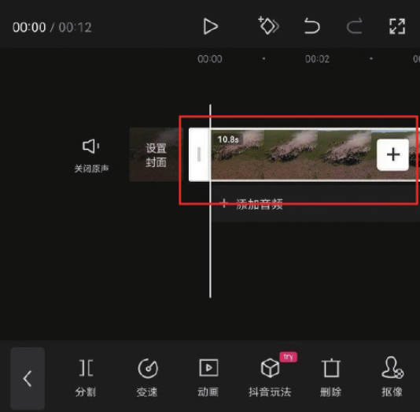
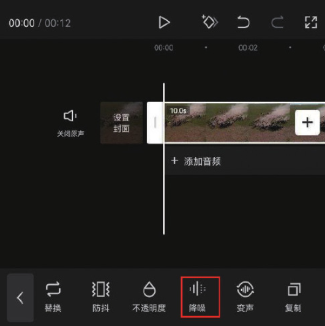
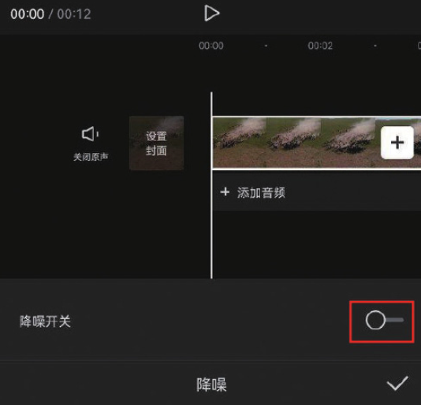
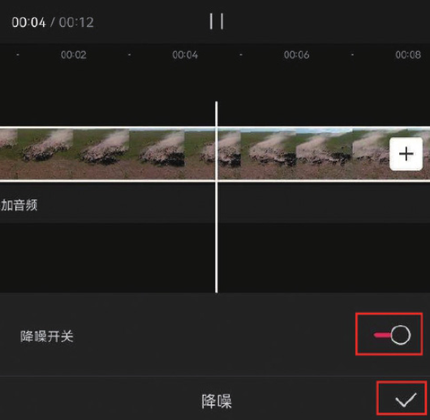

在日常拍摄时，由于受到环境因素的影响，拍摄的短片或多或少会夹杂一些杂音，非常影响观看体验。剪映为用户提供的“降噪”功能可以帮助用户去除音频中的各类杂音、噪声等，从而有效提升音频的质量。

创建项目后，在主界面点击“开始创作”按钮，进入素材添加界面，添加一段需要进行降噪处理的素材，然后在时间轴中选中该素材，如图 3-18 所示。在底部工具栏中点击“降噪”按钮，如图 3-19 所示。

在界面底部的选项栏中可以看到，此时的“降噪开关”处于关闭状态，如图 3-20 所示。直接点击按钮即可将“降噪开关”打开，剪映会自动进行降噪处理，完成后点击右下角的按钮即可保存，如图 3-21 所示。

