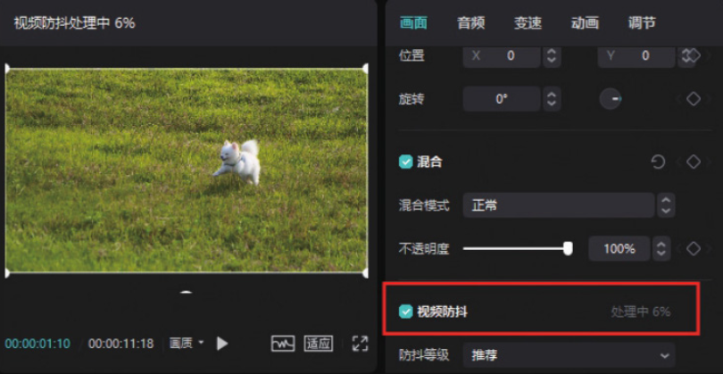
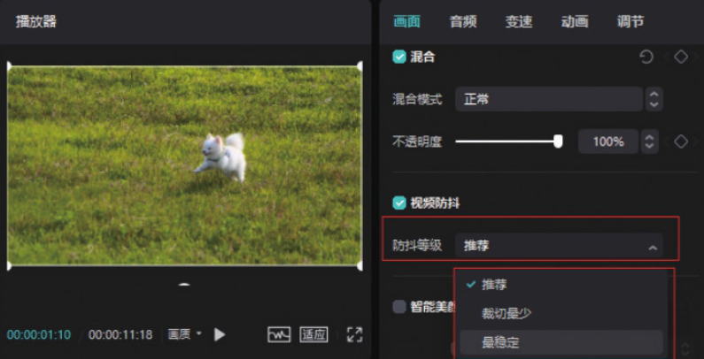
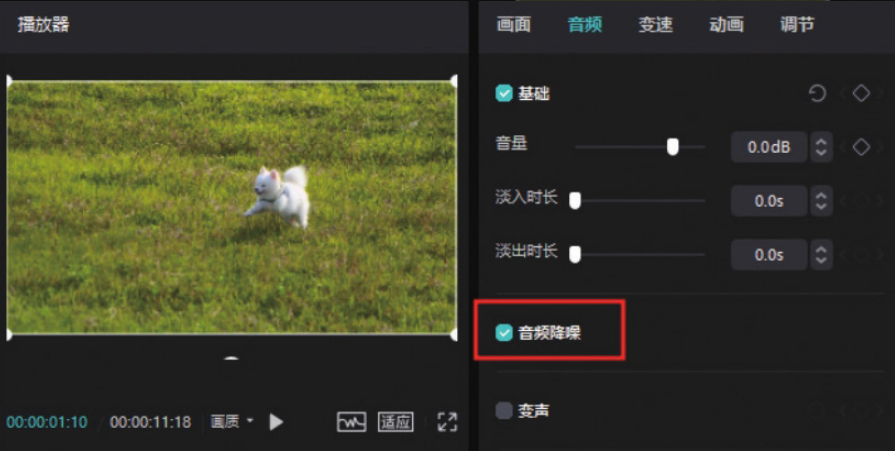

剪映专业版中的“防抖”和“降噪”功能都位于素材调整区，但“防抖”功能位于“画面”功能区，而“降噪”功能则位于“音频”功能区。

在时间轴中选中需要进行防抖和降噪处理的素材，在素材调整区勾选“视频防抖”复选框，如图 3-22 所示。



单击“防抖等级”下拉按钮，在下拉列表中可以看到“推荐”​“裁切最少”​“最稳定”三个选项，用户可以根据自己的需求进行选择，如图 3-23 所示。



如果需要对视频进行降噪处理，则需在素材调整区单击切换至“音频”功能区，然后勾选“音频降噪”复选框，即可对视频进行降噪处理，如图 3-24 所示。



```
无论是“防抖”功能还是“降噪”功能，其作用都是有限的。想获得高品质的视频，需要尽量在前期就拍摄出相对平稳且低噪声的画面。例如，使用稳定器及降噪麦克风进行拍摄。
```
