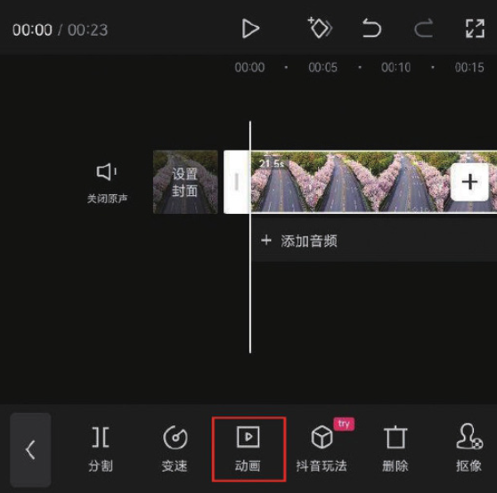
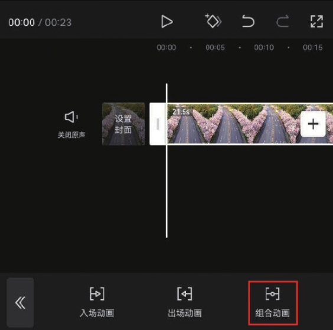
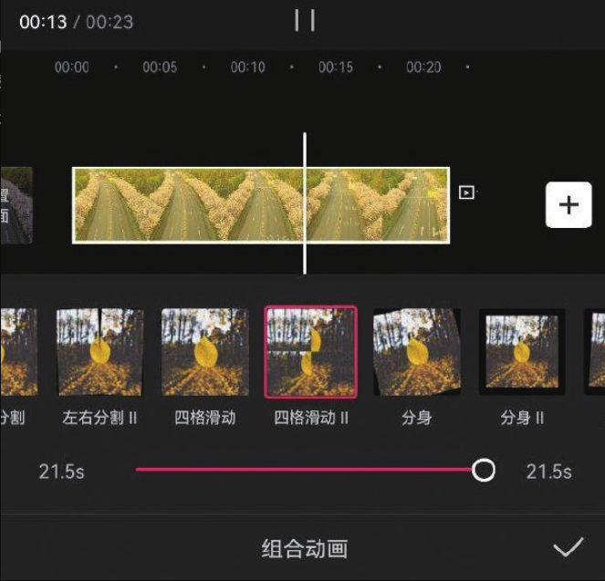

剪映的“动画”功能包含“入场动画”​“出场动画”​“组合动画”三个选项。​“入场动画”应用于视频开场，​“出场动画”则应用于视频结尾，而“组合动画”是连续、重复且有规律的动画效果，具有一定的持续性。下面以组合动画效果的添加为例，为大家讲解剪映 App 中动画效果的具体应用方法。

在时间轴中选中需要添加动画效果的视频片段，点击底部工具栏中的“动画”按钮，如图 3-25 所示。进入动画选项栏，可以看到其中有“入场动画”​“出场动画”​“组合动画”三个选项，点击“组合动画”按钮，如图 3-26 所示。




进入动画效果选项栏，点击任意一个效果选项的缩览图，即可为所选片段添加相应的动画效果并进行预览，移动动画时长滑块还可以调整动画的作用时间，如图 3-27 所示。当动画时长较短时，画面变化节奏会显得更快，更容易营造视觉冲击力；当动画时长较长时，画面变化相对缓慢，适合营造轻松的画面氛围。



```
在剪映App中设置动画时长后，具有动画效果的时间范围会在轨道上呈现浅绿色的覆盖，这样可以直观地显示动画时长与整个视频片段时长之间的比例关系。
```
