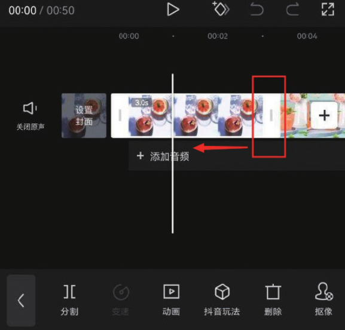
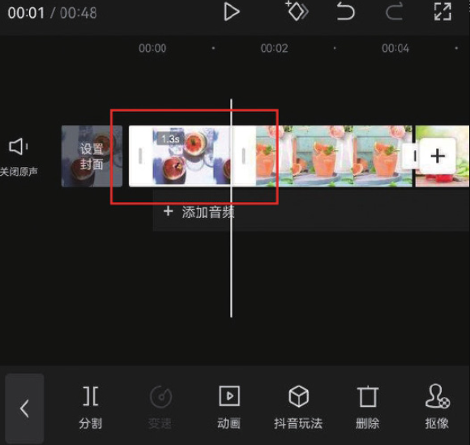
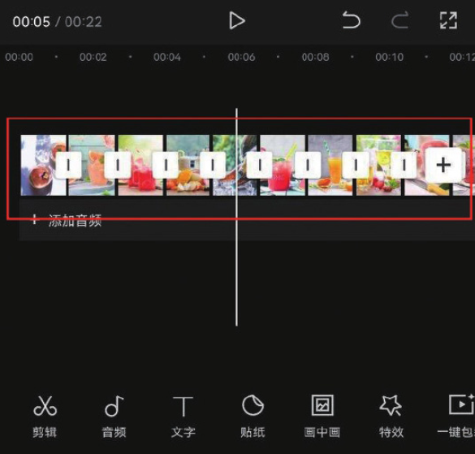
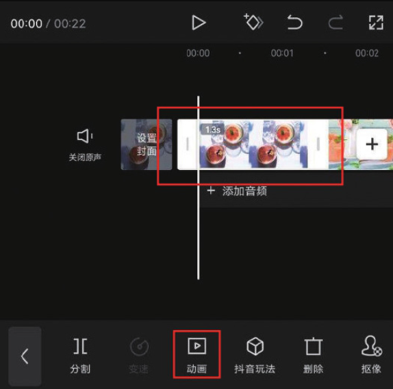
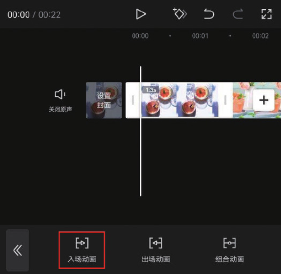
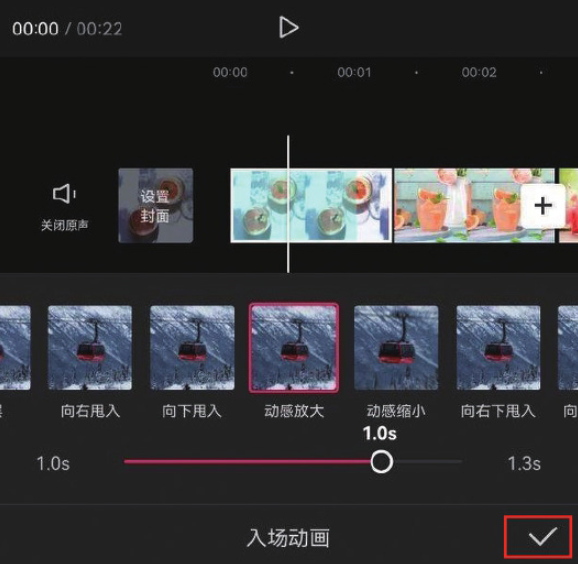
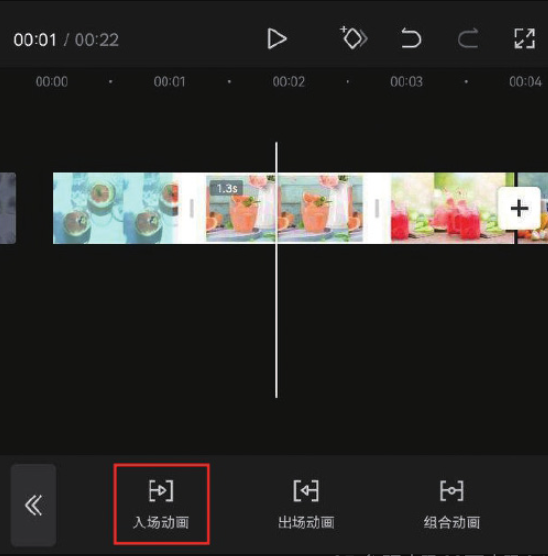
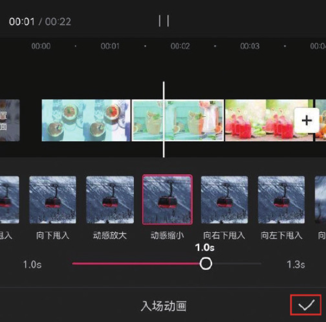

本案例介绍的是夏日饮品混剪短视频的制作方法，主要使用剪映的“动画”功能。下面介绍具体的操作方法。

01 在剪映 App 中添加 16 张“饮品”图像素材，在时间轴中选中第 1 段素材，使其边缘出现白色边框，如图 3-28 所示，将素材片段右侧的边框向左拖动，使其时长缩短至 1.3s，如图 3-29 所示。

02 参照步骤 01 的操作方法，将余下素材的时长都调整为 1.3s，如图 3-30 所示。在时间轴中选中第 1 段素材，然后点击底部工具栏中的“动画”按钮，如图 3-31 所示。

03 打开动画选项栏，点击“入场动画”按钮，如图 3-32 所示，在“入场动画”选项栏中选择“动感放大”效果，并拖动动画时长滑块，将参数设置为 1.0s，点击右下角的按钮保存，如图 3-33 所示。

04 在时间轴中选中第 2 段素材，点击底部工具栏中的“入场动画”按钮，如图 3-34 所示，在“入场动画”选项栏中选择“动感缩小”效果，拖动动画时长滑块，将参数设置为 1.0s，点击右下角的按钮保存，如图 3-35 所示。

05 参照步骤 02 至步骤 04 的操作方法，为剩余 14 段素材添加“动感放大”或“动感缩小”的动画效果。为视频添加一首合适的背景音乐，添加完成后即可点击“导出”按钮，将视频保存至相册，效果如图 3-36 和图 3-37 所示。

