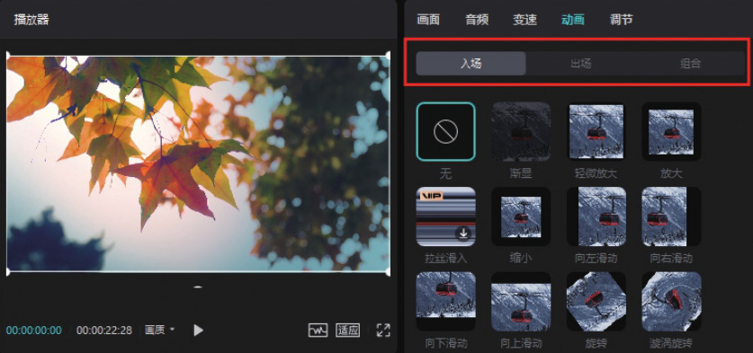
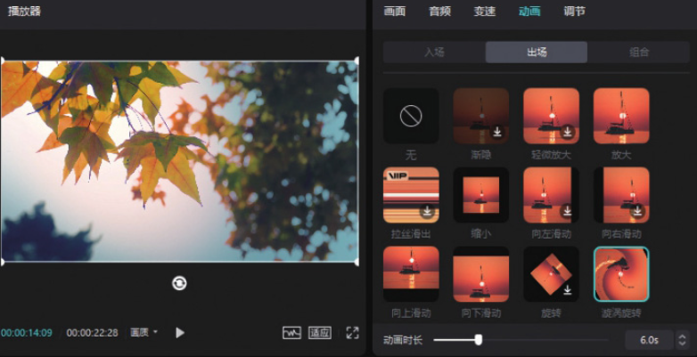
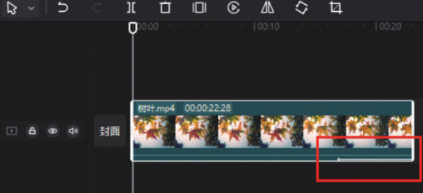
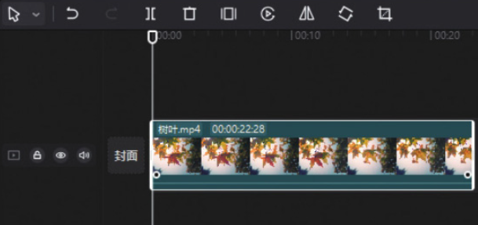

剪映专业版中的“动画”功能位于素材调整区。在时间轴中选中需要添加动画效果的素材片段后，在素材调整区单击切换至“动画”功能区，可以看到有“入场”​“出场”​“组合”三个选项，如图 3-38 所示。



这里以出场动画效果的添加为例进行说明。在“动画”功能区单击切换至出场动画效果选项栏，单击任意一个效果选项的缩览图，即可为所选片段添加相应的动画效果。拖曳下方的“动画时长”滑块可以调整动画的作用时间，如图 3-39 所示。



在剪映专业版中，为某一素材添加动画效果后，该素材的轨道上会出现一个箭头标识，如图 3-40 所示。倘若用户想去除添加的动画效果，可以在动画效果选项栏中单击去除按钮，即可将添加的动画效果去除，如图 3-41 所示。




```
动画时长的可设置范围取决于所选片段的时长变化。通常来说，每一个视频片段的结尾附近（落幅）最好是比较稳定的，这样可以让观众清晰地看到该镜头所表现的内容。因此，不建议让整个视频片段都具有动画效果。但对于一些一闪而过的画面，或者故意让观众看不清的画面，可以缩短其所在视频片段时长并添加动画效果。
```
