美颜美体，顾名思义，是“美颜”功能和“美体”功能的组合，其中“美颜”包含“智能美颜”​“智能美型”​“手动精修”三个选项，而“美体”则包含“智能美体”和“手动美体”两个选项，下面分别进行介绍。

## 1. 美颜

在剪映 App 中添加一段需要进行美颜的素材，在时间轴中选中该素材，点击底部工具栏中的“美颜美体”按钮，打开美颜美体选项栏，点击“美颜”按钮，如图 3-42 和图 3-43 所示。

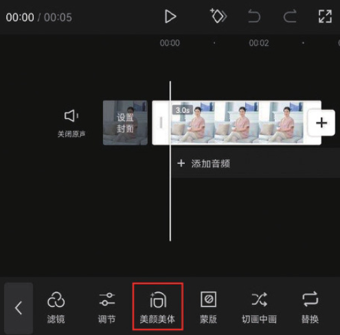
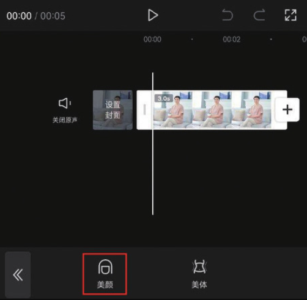

进入默认的“智能美颜”选项栏后，可以看到有“磨皮”​“祛黑眼圈”​“祛法令纹”​“美白”​“白牙”等选项，如图 3-44 所示。点击“磨皮”按钮，拖曳白色圆圈滑块，即可调整“磨皮”效果的强弱，如图 3-45 所示。

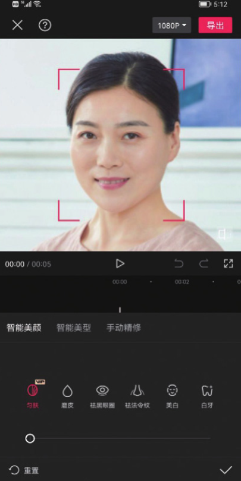
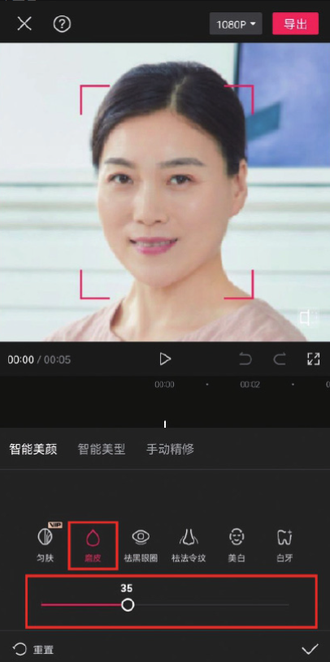

点击切换至“智能美型”选项栏后，可以看到里面根据人物的面部、眼部、鼻子、嘴巴等部位设置了细分的选项，当“瘦脸”图标显示为红色时，表示目前正处于瘦脸状态，拖曳白色圆圈滑块，即可调整“瘦脸”效果的强弱，如图 3-46 所示。

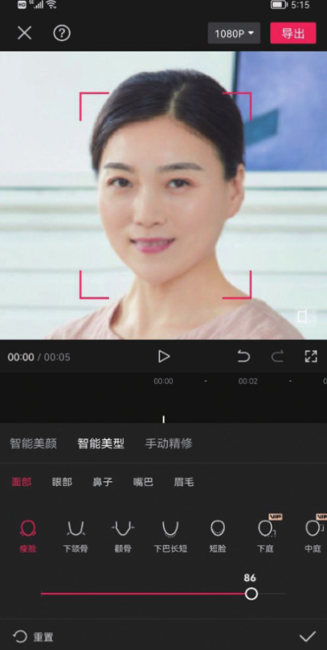

点击切换至“手动精修”选项栏，里面只有“手动瘦脸”一个选项，拖曳白色圆圈滑块，即可调整“瘦脸”效果的强弱，如图 3-47 所示。

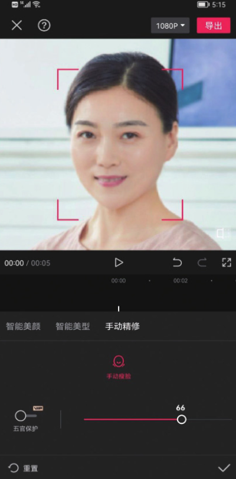

## 2. 美体

在剪映 App 中添加一段需要进行美体处理的素材，在时间轴中选中该素材，点击底部工具栏中的“美颜美体”按钮，打开美颜美体选项栏，点击“美体”按钮，如图 3-48 和图 3-49 所示。

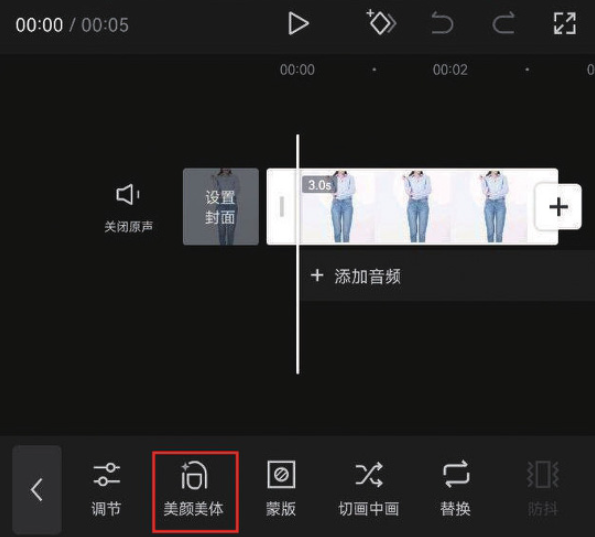
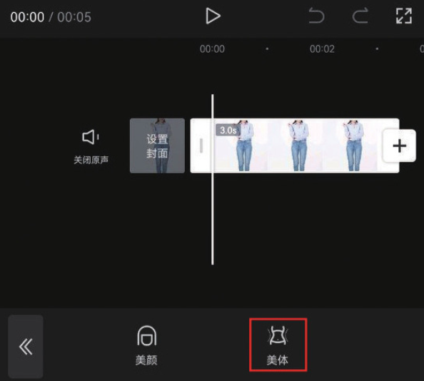

进入默认的“智能美体”选项栏后，可以看到有“磨皮”​“美白”​“瘦身”​“长腿”​“瘦腰”等选项。点击“长腿”按钮，拖曳白色圆圈滑块，即可调整“长腿”效果的强弱，如图 3-50 所示。

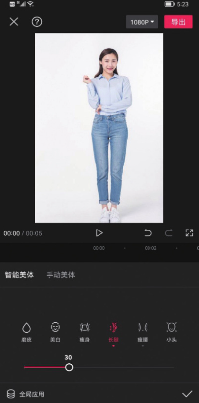

同理，点击“瘦腰”按钮，拖曳白色圆圈滑块，即可调整“瘦腰”效果的强弱，如图 3-51 所示。

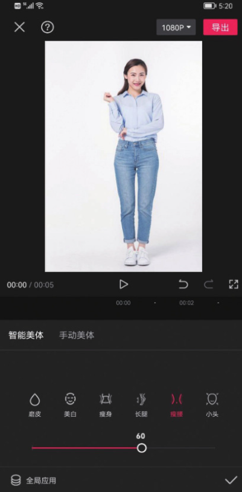

点击切换至“手动美体”选项栏后，可以看到里面有“拉长”​“瘦身瘦腿”​“放大缩小”三个选项。当“拉长”图标显示为红色时，在预览区移动黄色线条，选择需要拉长的部位，拖曳底部的白色圆圈滑块，即可将人物被选取的部位拉长，如图 3-52 所示。

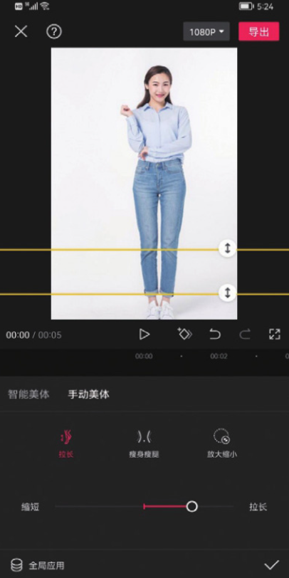

同理，点击“瘦身瘦腿”按钮，在预览区移动黄色线条，选择需要进行调整的部位，拖曳底部的白色圆圈滑块，即可让人物被选取的部位变窄或变宽，如图 3-53 所示。

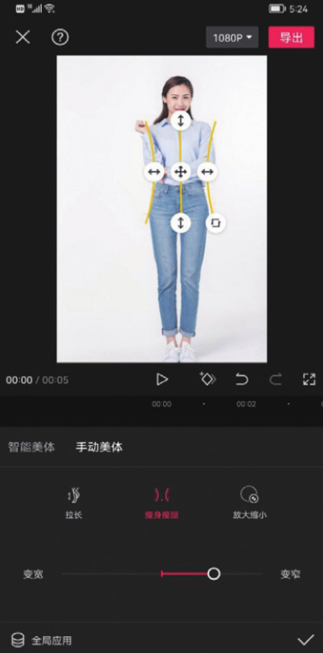
