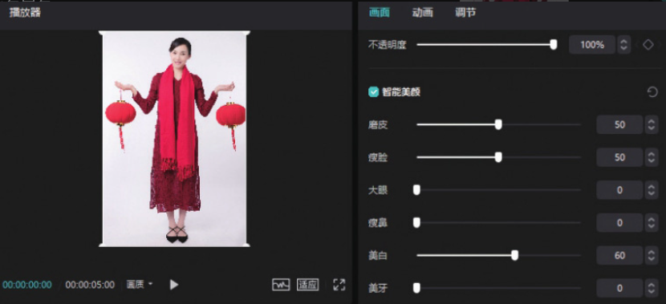
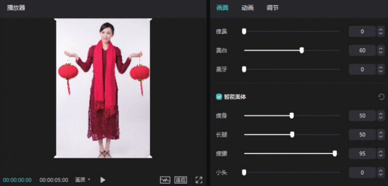

相比于剪映 App，剪映专业版的美颜美体功能分类较为简单，只有“智能美颜”和“智能美体”两个选项，但其功能仍然齐全，​“美白”​“瘦脸”​“瘦腰”​“长腿”等效果应有尽有。

在时间轴中选中需要进行美颜美体处理的素材，在素材调整区勾选“智能美颜”复选框，可以看到选项栏中有“磨皮”​“瘦脸”​“大眼”​“瘦鼻”​“美白”​“美牙”6 个选项。勾选“智能美颜”复选框后，系统会默认将“磨皮”和“瘦脸”的数值调整为 50，用户可以在选项栏中拖曳各个选项旁边的白色滑块来调整各项效果的强弱，如图 3-54 所示。

同理，当用户勾选“智能美体”复选框后，可以看到选项栏中有“瘦身”​“长腿”​“瘦腰”​“小头”4 个选项，系统会默认将“瘦身”和“长腿”的数值调整为 50，用户可以在选项栏中拖曳各个选项旁边的白色滑块来调整各项效果的强弱，如图 3-55 所示。

