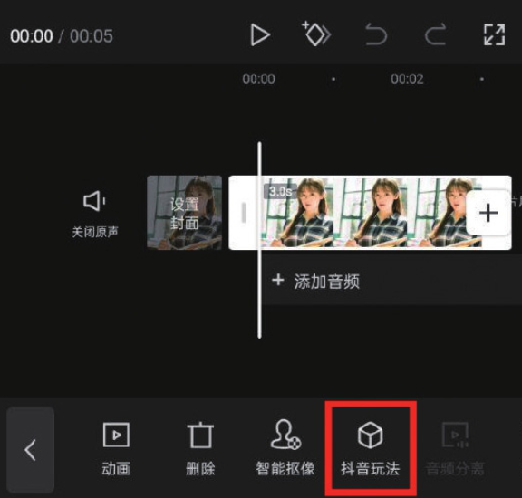
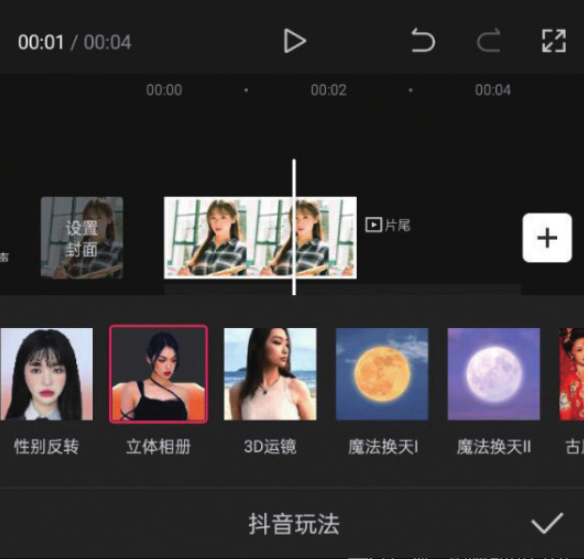

“抖音玩法”的应用在抖音上很常见，其操作方法很简单，下面将通过制作人物立体相册效果来讲解这项功能的具体应用方法。

首先在剪辑项目中添加一张需要使用的人物图像素材，然后在时间轴中选中该素材，点击底部工具栏中的“抖音玩法”按钮，在效果选项栏中选择“立体相册”选项，如图 3-56 和图 3-57 所示。

等待片刻，剪映即可自动合成立体相册效果，最后点击界面右下角的确认按钮即可保存。图 3-58 为“立体相册”效果的示意图。

