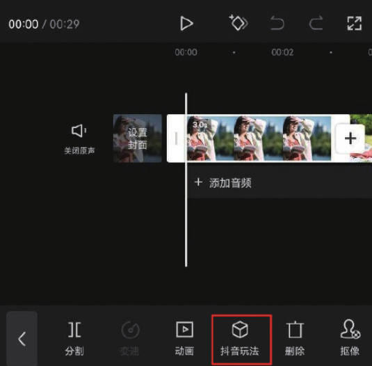
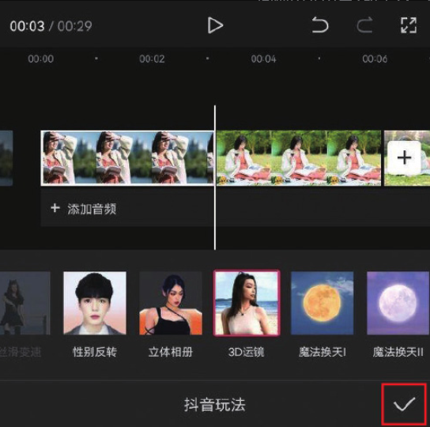
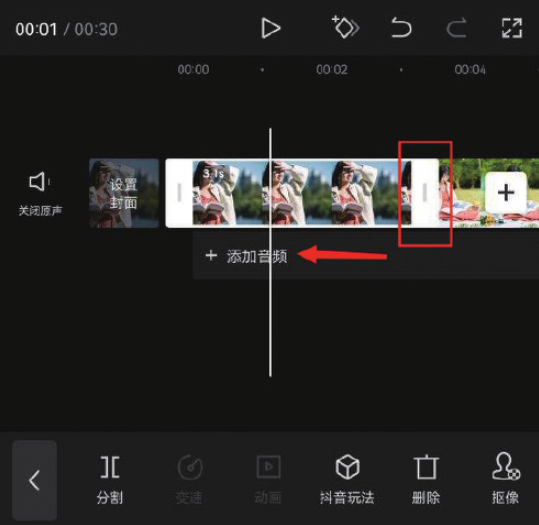
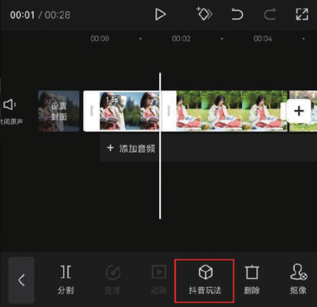

本案例介绍的是 3D 运镜电子相册的制作方法，主要使用剪映的“抖音玩法”功能。下面介绍具体的操作方法。

01 打开剪映 App，在主界面点击“开始创作”按钮，进入素材添加界面，依次选择 9 张人物写真的图像素材，点击“添加”按钮，进入视频编辑界面，如图 3-59 和图 3-60 所示。

02 在时间轴中选中第 1 段素材，点击底部工具栏中的“抖音玩法”按钮，如图 3-61 所示，在效果选项栏中选择“3D 运镜”选项，点击右下角的按钮保存，如图 3-62 所示。

03 参照步骤 02 的操作方法，为余下 8 段素材添加“3D 运镜”效果。在时间轴中选中第 1 段素材，使其边缘出现白色边框，将素材片段右侧的边框向左拖动，使其时长缩短至 1.5s，如图 3-63 和图 3-64 所示。

04 参照步骤 03 的操作方法将余下素材的时长都调整为 1.5s。为视频添加一首合适的背景音乐，添加完成后即可点击“导出”按钮，将视频保存至相册，效果如图 3-65 和图 3-66 所示。

