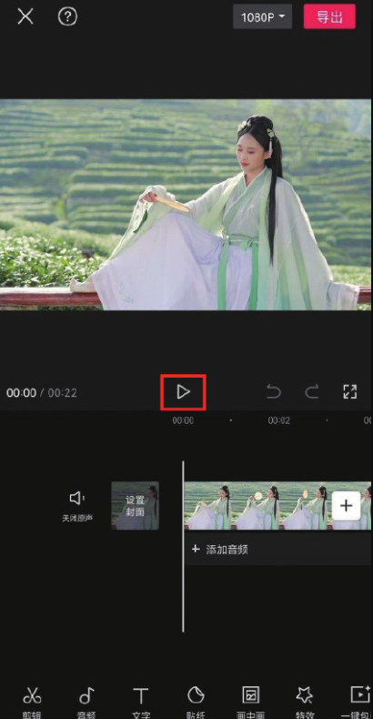
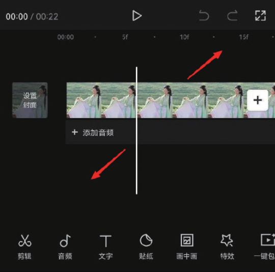
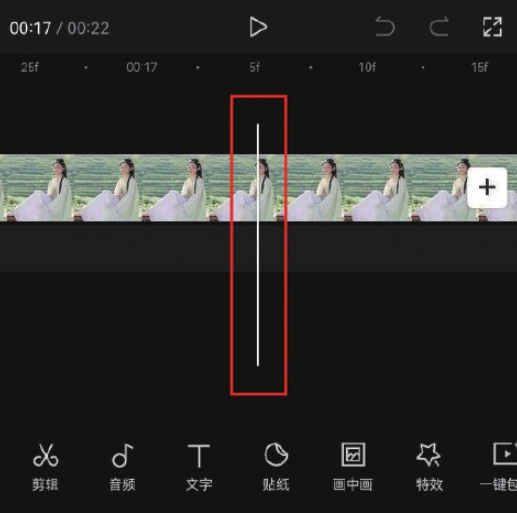
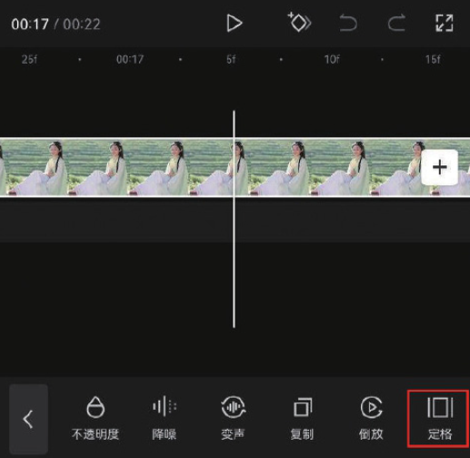
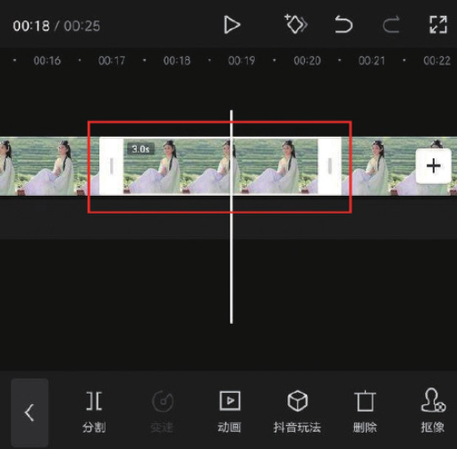

“定格”功能可以将一段视频中的某个画面“凝固”​，从而起到突出某个瞬间效果的作用。另外，如果一段视频中多次出现定格画面，并且其时间点与音乐节拍相匹配，可让视频具有律动感。

打开剪映 App，在主界面点击“开始创作”按钮，进入素材添加界面，选择“古风美女”的素材并将其添加至剪辑项目中。进入视频编辑界面后，点击播放按钮预览素材效果，如图 3-67 所示。可以通过预览素材确定定格的时间点。在时间轴中分开双指，将轨道放大，如图 3-68 所示。

将时间线移动至第 17 秒第 5 帧的位置，如图 3-69 所示。在时间轴中选中素材，点击底部工具栏中的“定格”按钮，如图 3-70 所示。

操作完成后，轨道中将生成一段时长为 3 秒的静帧画面，同时视频片段的时长也由 22 秒变成了 25 秒，如图 3-71 所示。

剪映专业版的“定格”功能按钮位于常用功能区，其使用方法与剪映 App 中一致，在时间轴中选中素材后，将时间线移动至需要定格的位置，单击“定格”按钮，轨道中即可生成一段时长为 3 秒的定格片段。
