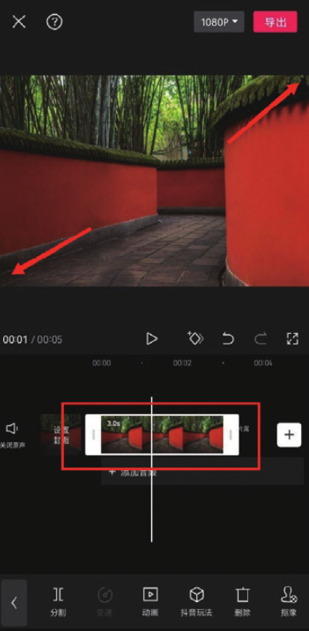
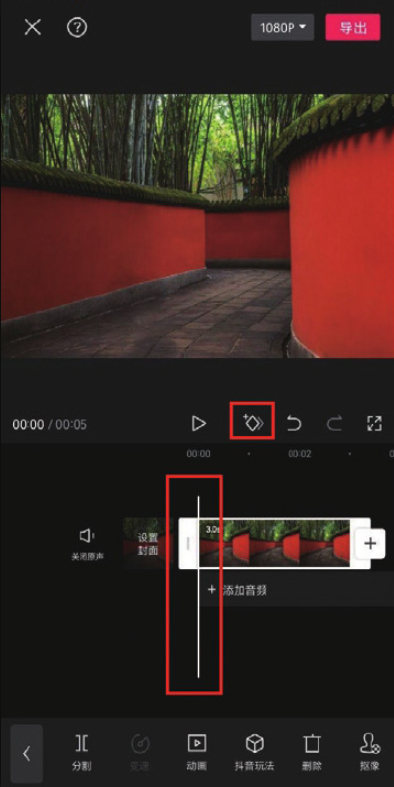
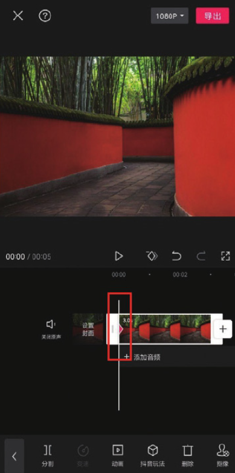
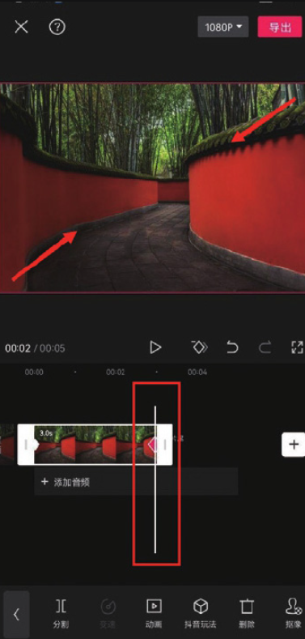

使用关键帧功能可以让一些原本不会移动的、非动态的元素在画面中动起来，还可以让一些后期增加的效果随时间渐变，下面通过制作运镜效果来讲解关键帧功能的使用方法。

在时间轴中选中需要进行编辑的素材，然后在预览区分开双指，将画面放大，如图 3-72 所示。将时间线移动至视频的起始位置，点击界面中的按钮，添加一个关键帧，如图 3-73 所示。

操作完成后，轨道上会出现一个关键帧的标识，如图 3-74 所示。将时间线移动至视频的结尾处，在预览区捏合双指，将画面缩小，此时剪映会自动在时间线所在的位置再打上一个关键帧，如图 3-75 所示。至此，就完成了一个简单的运镜效果。

