本案例介绍的是古建筑混剪短视频的制作方法，主要使用剪映的关键帧、“复制”和“替换”功能。下面介绍具体的操作方法。

01 在剪映 App 中添加一段古建筑的视频素材，将时间线移动至视频第 2 秒的位置，在时间轴中选中素材，点击底部工具栏中的“分割”按钮，如图 3-76 所示，再点击“删除”按钮，将多余的片段删除，如图 3-77 所示。

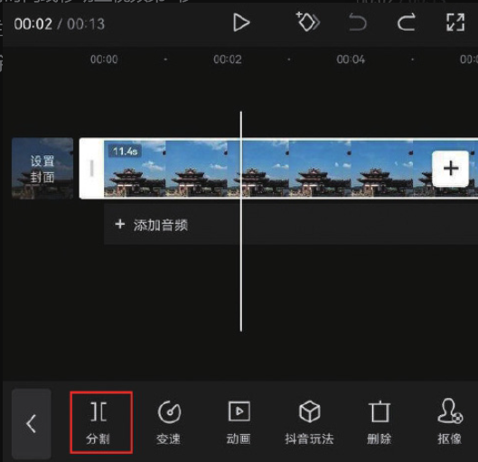
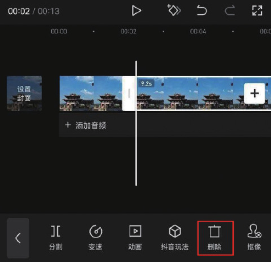

02 将时间线移动至视频的起始位置，在预览区分开双指，将画面放大，点击界面中的按钮，添加一个关键帧，如图 3-78 所示。

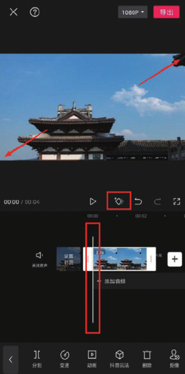

03 将时间线移动至视频的结尾处，在预览区将画面缩小，此时剪映会自动在时间线所在位置创建一个关键帧，如图 3-79 所示。

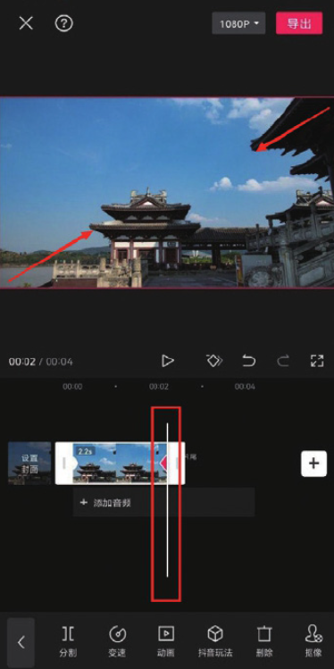

04 在时间轴中选中素材，点击底部工具栏中的“复制”按钮，在时间线区域复制出一段相同的素材，如图 3-80 和图 3-81 所示。

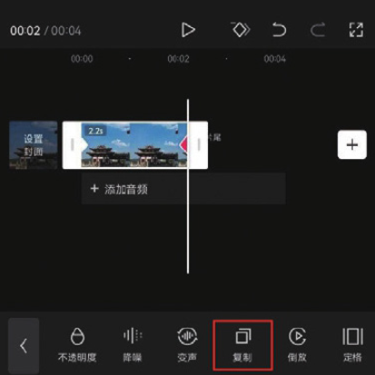
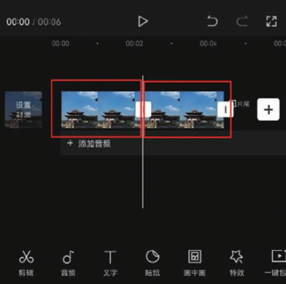

05 参照步骤 04 的操作方法，在时间轴中复制 8 段相同的素材，如图 3-82 所示。选中第 2 段素材，点击底部工具栏中的“替换”按钮，如图 3-83 所示。

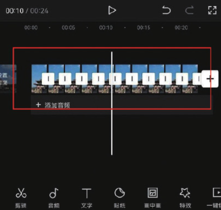
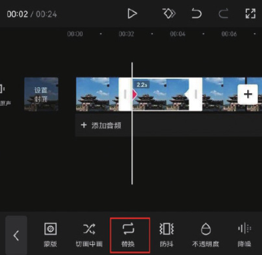

06 进入素材选取界面，选择一段新的古建筑视频，点击“确认”按钮，如图 3-84 和图 3-85 所示。

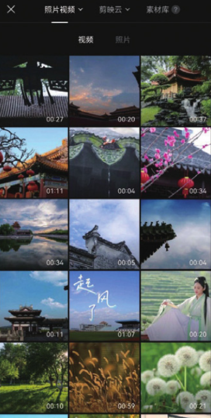
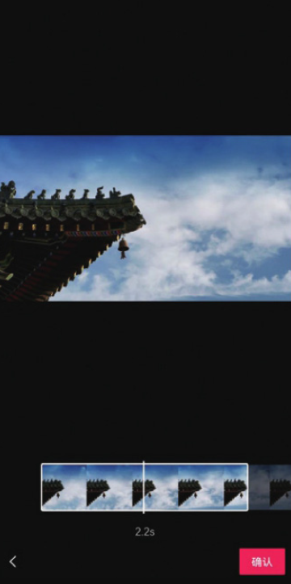

07 参照步骤 05 和步骤 06 的操作方法，将余下 8 段素材替换为新的视频，如图 3-86 所示。

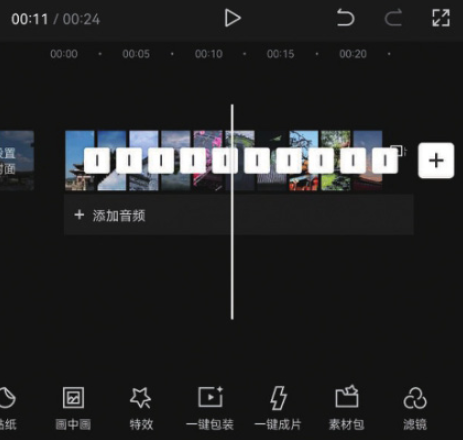

08 为视频添加一首合适的背景音乐，添加完成后即可点击“导出”按钮，将视频保存至相册，效果如图 3-87 和图 3-88 所示。

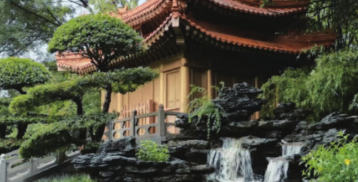
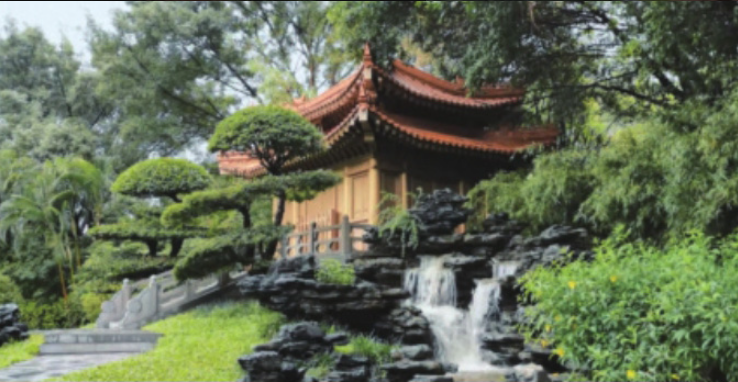
