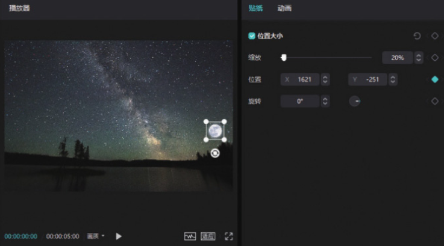
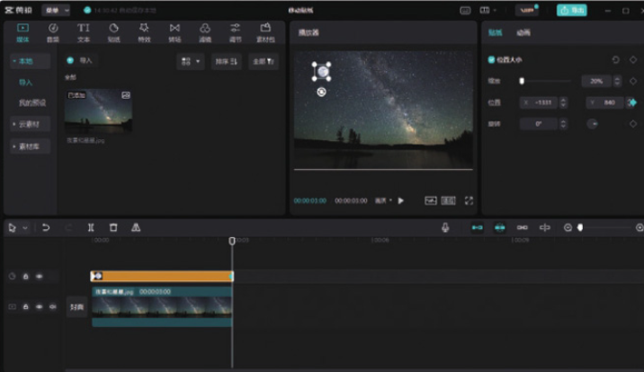

除了前面案例中的运镜效果外，关键帧还有很多应用方式。例如，关键帧结合滤镜，可以形成渐变色的效果；关键帧结合蒙版，可以形成蒙版逐渐移动的效果；关键帧甚至还能与音频轨道结合，形成任意阶段音量的渐变效果。下面通过移动贴纸来讲解剪映专业版中关键帧功能的使用方法。

在画面中添加一个月亮的图标贴纸，使用关键帧功能让原本不会移动的月亮贴纸动起来，形成从画面右下角往画面左上角移动的效果。

首先在预览区将月亮贴纸移动至画面的右下角，再将时间线移动至视频的起始位置，在素材调整区单击“位置”选项右侧的按钮，在时间线所在的位置打上一个关键帧，如图 3-89 所示。

将时间线移动至视频的结尾处，再在预览区将月亮贴纸移动至画面的左上角，此时剪映会自动在时间线所在的位置打上一个关键帧，如图 3-90 所示。

