本案例介绍的是干杯集锦短视频的制作方法，主要使用剪映的“变速”​“分割”​“删除”功能。下面介绍具体的操作方法。

01 打开剪映 App，在主界面点击“开始创作”按钮，进入素材添加界面，切换至“视频”选项，依次选择 12 段“干杯”的视频素材，点击“添加”按钮，进入视频编辑界面，如图 3-91 和图 3-92 所示。

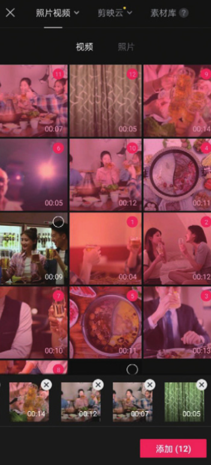
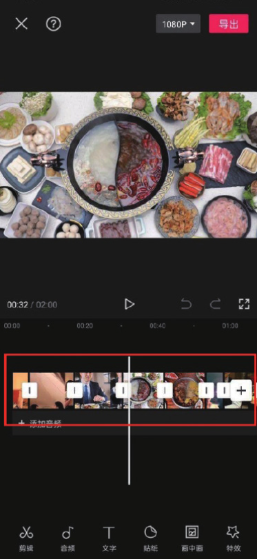

02 在时间轴中选中第 1 段素材，点击底部工具栏中的“变速”按钮，打开变速选项栏，再点击“常规变速”按钮，如图 3-93 和图 3-94 所示。

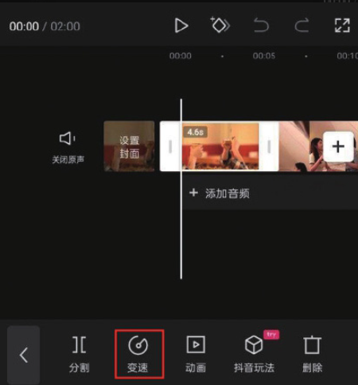
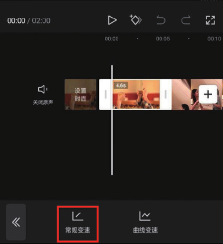

03 在底部选项栏中拖动变速滑块，将数值调整为 1.5x，点击按钮保存，如图 3-95 所示。

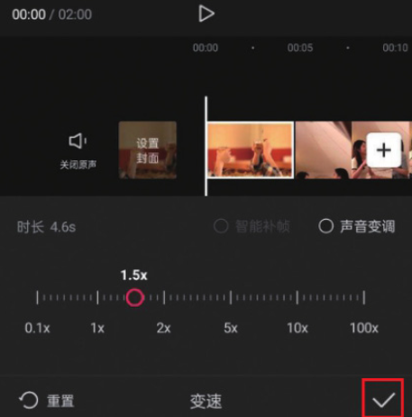

04 参照步骤 02 和步骤 03 的操作方法，将素材 2、素材 6、素材 7、素材 9、素材 10、素材 11、素材 12 设置为 1.5 倍速，将素材 3、素材 4、素材 8 设置为 3 倍速，将素材 5 设置为 5 倍速，如图 3-96 所示。

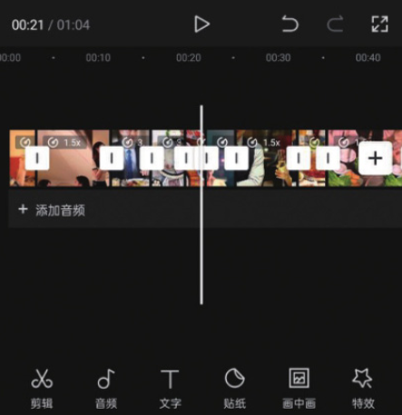

05 在时间轴中分开双指，将轨道放大。选中第 1 段素材，将时间线移动至视频画面中人物举杯的位置，点击底部工具栏中的“分割”按钮，将素材一分为二，如图 3-97 和图 3-98 所示。

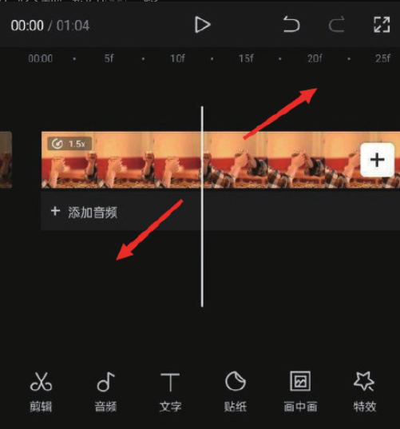
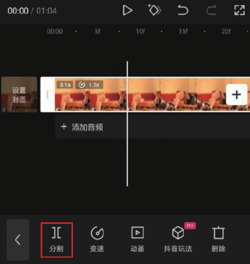

06 选中分割出来的前半段素材，点击底部工具栏中的“删除”按钮，将其删除，如图 3-99 所示。

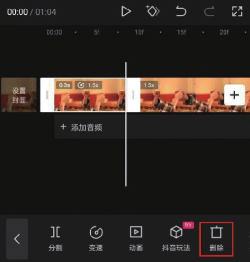

07 选中第 1 段素材，将时间线移动至视频画面中碰杯的位置，点击底部工具栏中的“分割”按钮，再选中分割出来的后半段素材，点击底部工具栏中的“删除”按钮，将其删除，如图 3-100 和图 3-101 所示。

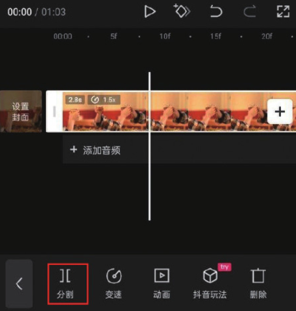
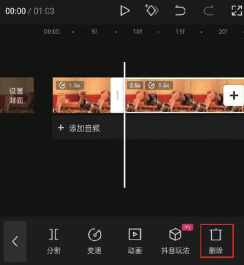

08 参照步骤 05 至步骤 07 的操作方法，对剩余的 11 段素材进行分割截取，只保留干杯的画面，如图 3-102 所示。

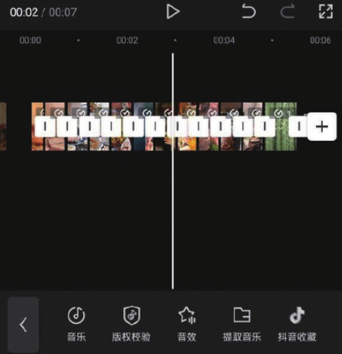

09 为视频添加一首合适的背景音乐，添加完成后即可点击“导出”按钮，将视频保存至相册，效果如图 3-103 和图 3-104 所示。

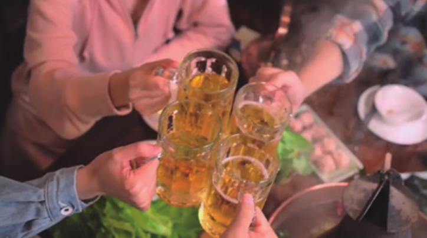
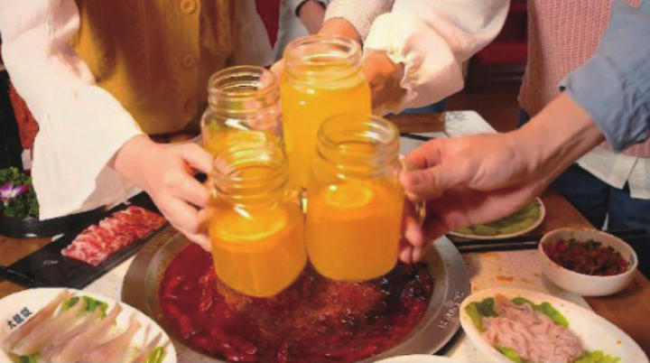
