案例介绍的是定格漫画效果的制作方法，主要使用剪映的“变速”​“定格”​“抖音玩法”功能。下面介绍具体的操作方法。

01 打开剪映 App，在主界面点击“开始创作”按钮，进入素材添加界面，切换至“视频”选项，依次选择 5 段“古风小镇”的视频素材，点击“添加”按钮，进入视频编辑界面，如图 3-105 和图 3-106 所示。

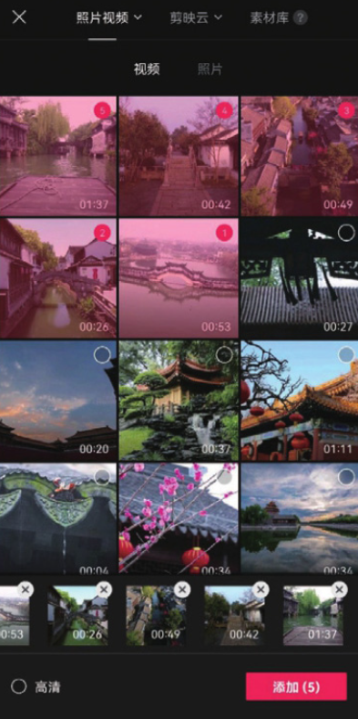
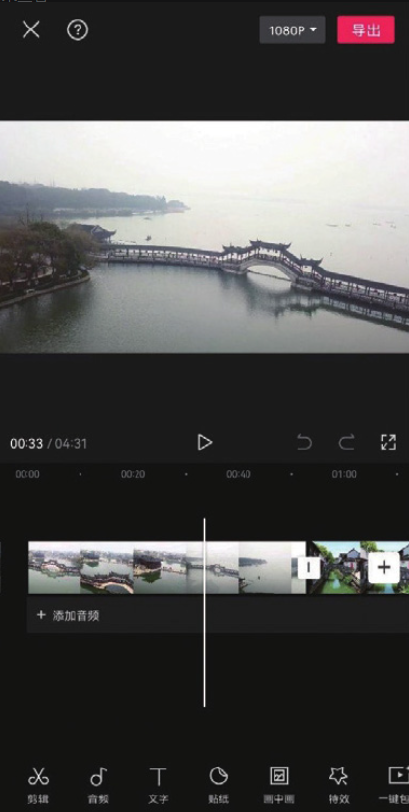

02 在时间轴中选中第 1 段素材，点击底部工具栏中的“变速”按钮，打开变速选项栏，再点击“常规变速”按钮，如图 3-107 和图 3-108 所示。

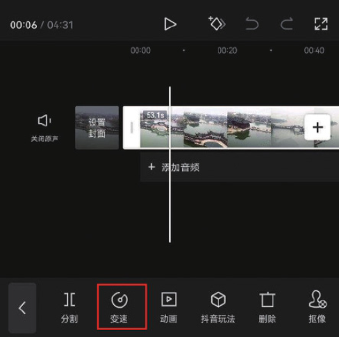
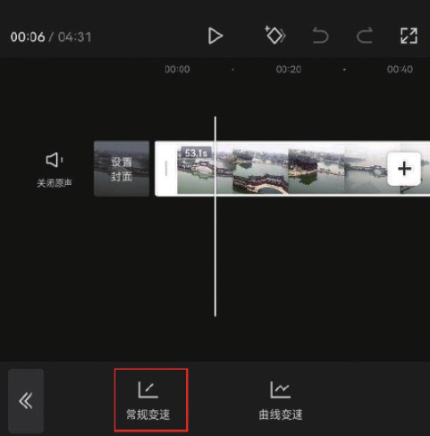

03 在底部选项栏中拖动变速滑块，将数值调整为 3.0x，点击确认按钮保存，如图 3-109 所示。

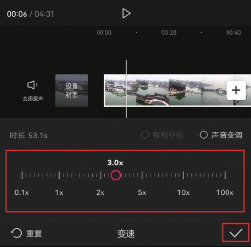

04 参照步骤 02 和步骤 03 的操作方法，将余下素材都设置为 3 倍速，如图 3-110 所示。

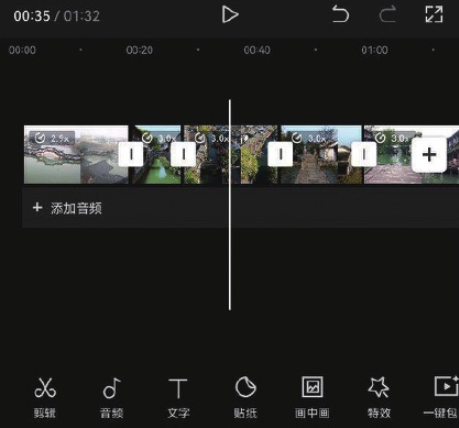

05 将时间线移动至需要进行画面定格的位置，在时间轴中选中第 1 段素材，点击底部工具栏中的“定格”按钮，如图 3-111 所示。

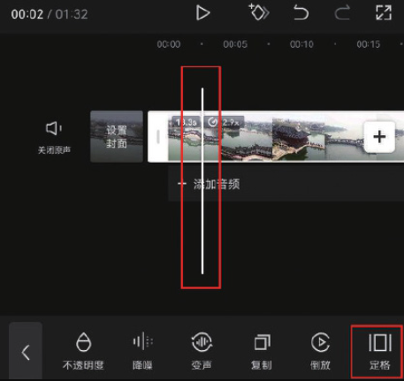

06 在时间轴中选中衔接在定格片段后的素材，点击底部工具栏中的“删除”按钮，将其删除，如图 3-112 所示。

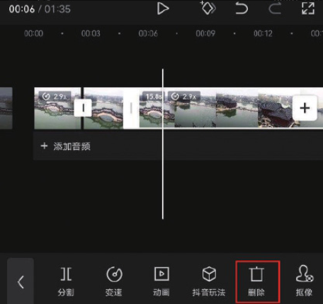

07 在时间轴中选中定格片段，点击底部工具栏中的“抖音玩法”按钮，选择“复古”选项，点击界面右下角确认的按钮保存，如图 3-113 和图 3-114 所示。

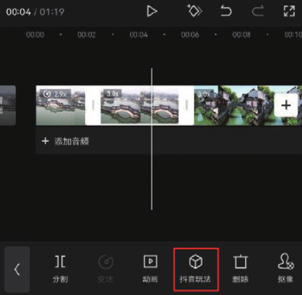
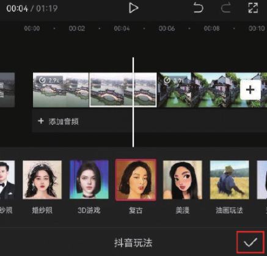

08 在时间轴中选中定格片段，使其边缘出现白色边框，将定格片段右侧的边框向左拖动，使片段时长缩短至 1 秒，如图 3-115 和图 3-116 所示。

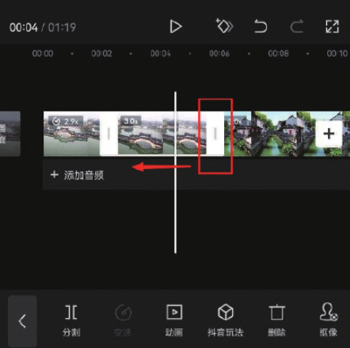
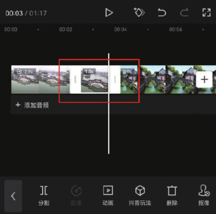

09 参照步骤 05 至步骤 08 的操作方法，为余下素材添加定格和复古漫画的效果，如图 3-117 所示。

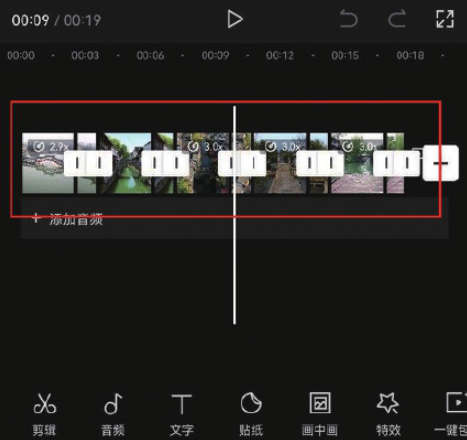

10 为视频添加一首合适的背景音乐，添加完成后即可点击“导出”按钮，将视频保存至相册，效果如图 3-118 和图 3-119 所示。

