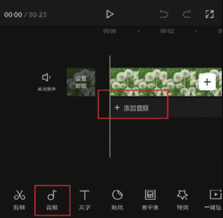
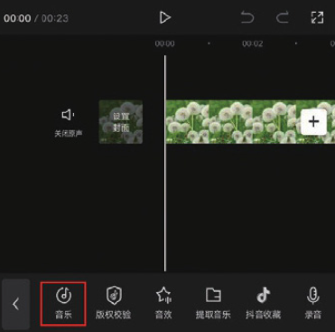
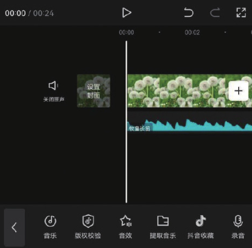

剪映的音乐库中有着非常丰富的音频资源，并且还对这些音频进行了十分细致的分类，如“舒缓”​“轻快”​“可爱”​“伤感”等，用户可以根据视频内容的基调快速找到合适的背景音乐。

在时间轴中将时间线移动至需要添加背景音乐的时间点，在未选中素材的状态下，点击“添加音频”按钮，或点击底部工具栏中的“音频”按钮，然后在打开的音频选项栏中点击“音乐”按钮，如图 4-2 和图 4-3 所示。

完成上述操作后，进入剪映音乐素材库，如图 4-4 所示。剪映音乐素材库对音乐进行了细致的分类，用户可以根据音乐类别来快速挑选适合影片基调的背景音乐。

在音乐素材库中，点击任意一款音乐，即可对音乐进行试听。此外，点击音乐素材右侧的功能按钮，可以对音乐素材进行进一步处理，如图 4-5 所示。

音乐素材旁边的功能按钮说明如下。

● 收藏音乐：点击该按钮，可将音乐添加至音乐素材库的“收藏”列表中，方便下次使用。

● 下载音乐：点击该按钮，可以下载音乐，下载完成后会自动播放音乐。

● 使用音乐：下载完音乐后，将出现该按钮，点击该按钮，即可将音乐添加到剪辑项目中，如图 4-6 所示。

