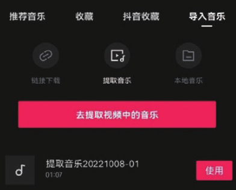
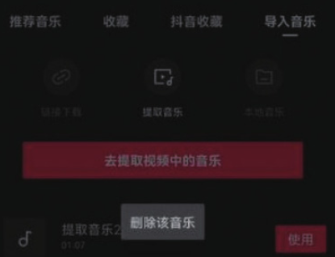
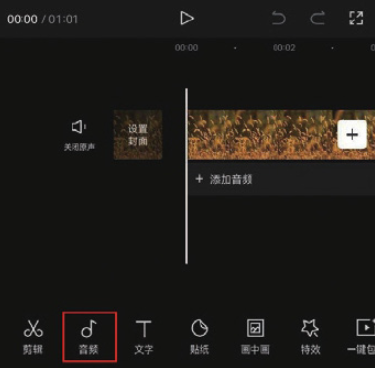
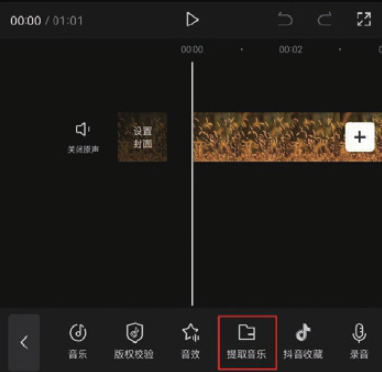

剪映支持用户对本地相册中拍摄和存储的视频中的音乐进行提取，简单来说就是将其他视频中的音乐提取出来并单独应用到剪辑项目中。

提取视频中音乐的方法非常简单，在音乐素材库中，切换至“导入音乐”选项，然后在选项栏中点击“提取音乐”按钮，接着点击“去提取视频中的音乐”按钮，如图 4-7 所示。在打开的素材选取界面选择带有音乐的视频，然后点击“仅导入视频的声音”按钮，如图 4-8 所示。

完成上述操作后，视频中的背景音乐将被提取并导入音乐素材库中，如图 4-9 所示。如果想将导入素材库中的音乐素材删除，则需在界面上按住素材，点击出现的“删除该音乐”按钮即可，如图 4-10 所示。

除了可以在音乐素材库中进行音乐的提取操作外，用户还可以选择在视频编辑界面完成提取音乐的操作。在未选中素材的状态下，点击底部工具栏中的“音频”按钮，如图 4-11 所示，然后在打开的音频选项栏中点击“提取音乐”按钮，如图 4-12 所示，即可进行视频音乐的提取操作。

