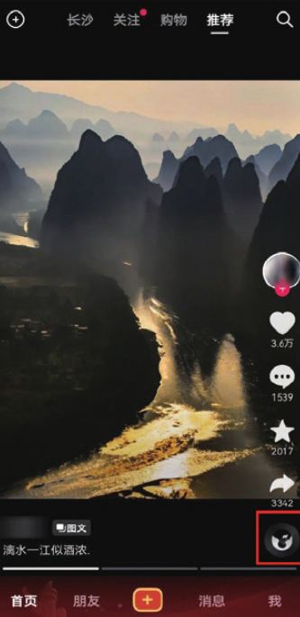
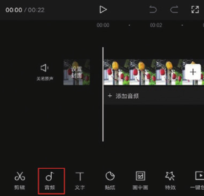
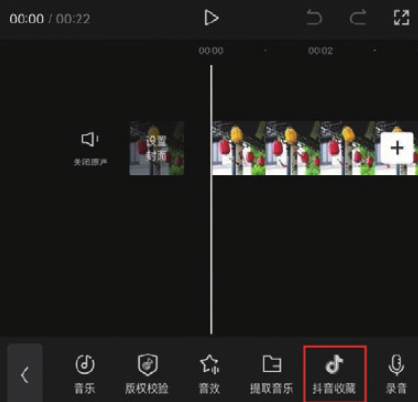
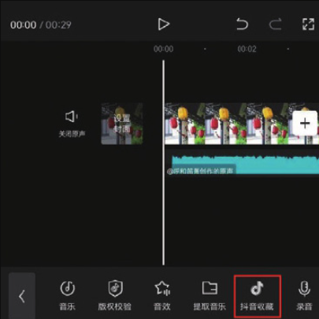

作为一款与抖音直接关联的短视频剪辑软件，剪映支持用户在剪辑项目中添加抖音中的音乐。在进行该操作前，用户需要在剪映主界面上切换至“我的”界面，登录自己的抖音账号。建立起剪映与抖音的连接后，用户就可以直接在剪映的“抖音收藏”列表中找到在抖音中收藏的音乐并进行调用了。下面介绍具体的操作方法。

```
使用抖音账号登录剪映的操作可参阅本书1.1.4小节的内容。
```

打开抖音 App，在视频播放界面点击界面右下角 CD 形状的按钮，如图 4-13 所示，进入“拍同款”界面，点击“收藏”按钮，即可收藏该视频的背景音乐，如图 4-14 和图 4-15 所示。




进入剪映 App，打开需要添加音乐的剪辑项目，进入视频编辑界面，在未选中素材的状态下，将时间线定位至视频起始位置，然后点击底部工具栏中的“音频”按钮，如图 4-16 所示。在打开的音频选项栏中点击“抖音收藏”按钮，如图 4-17 所示。




进入剪映的音乐素材库，在界面下部的“抖音收藏”列表中可以看到刚刚收藏的音乐，如图 4-18 所示，点击下载音乐，再点击“使用”按钮，即可将收藏的音乐添加至剪辑项目中，如图 4-19 所示。




```
如果想在剪映App中将“抖音收藏”列表中的音乐素材删除，只需在抖音中取消收藏该音乐即可。
```
