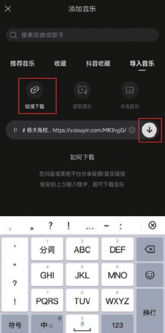

如果剪映音乐素材库中的音乐素材不能满足剪辑需求，那么用户可以尝试通过视频链接提取其他视频中的音乐。

以抖音为例，用户如果想将该平台上某个视频的背景音乐导入剪映中使用，可以在抖音的视频播放界面点击右侧的分享按钮，再在底部选项栏中点击“复制链接”按钮，如图 4-20 和图 4-21 所示。


操作完成后，进入剪映音乐素材库，切换至“导入音乐”选项，然后在选项栏中点击“链接下载”按钮，在文本框中粘贴之前复制的音乐链接，再点击右侧的下载按钮，等待片刻，解析完成后即可点击“使用”按钮，将音乐添加到剪辑项目中，如图 4-22 和图 4-23 所示。




```
对于想靠视频作品营利的用户来说，在使用其他平台上的音乐作为视频素材前，需与平台或音乐创作者进行协商，以避免侵权行为的发生。
```
