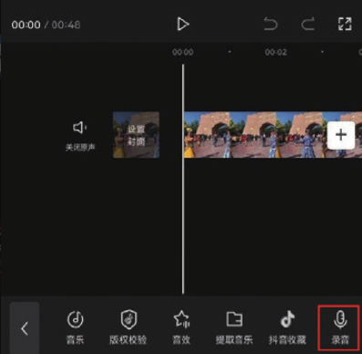
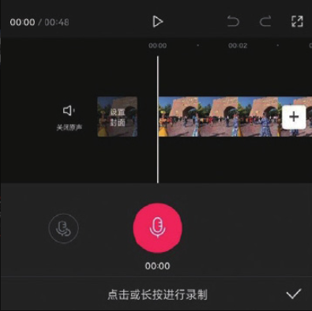
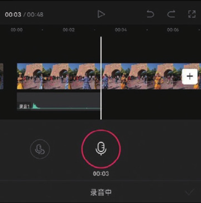
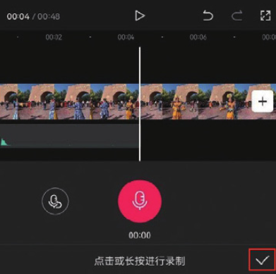

通过剪映的“录音”功能，用户可以实时在剪辑项目中完成旁白的录制和编辑工作。在使用剪映录制旁白前，最好连接上耳麦，有条件的话可以配备专业的录制设备，这样能有效提升声音质量。

在开始录音前，先将时间线移动至视频的起始位置，在未选中任何素材的状态下，点击音频选项栏中的“录音”按钮，然后在底部选项栏中按住红色的录制按钮，如图 4-24 和图 4-25 所示。

在按住录制按钮的同时，轨道区域将同时生成音频素材，如图 4-26 所示，此时用户可以根据视频内容录入相应的旁白。录制完成后，释放录制按钮，即可停止录音。点击右下角的按钮，即可保存音频素材，如图 4-27 所示。

在录音过程中，口型不匹配或环境干扰可能导致音效不自然，因此大家尽量选择安静、没有回音的环境进行录制。录音时嘴巴需与麦克风保持一定的距离，可以尝试用打湿的纸巾将麦克风裹住，防止喷麦。
