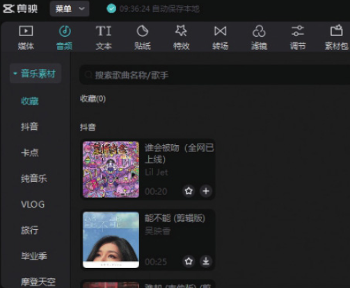
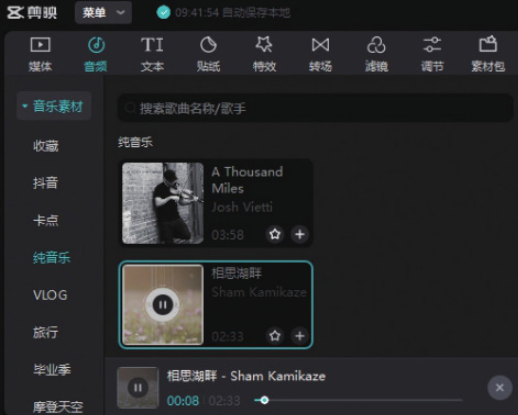
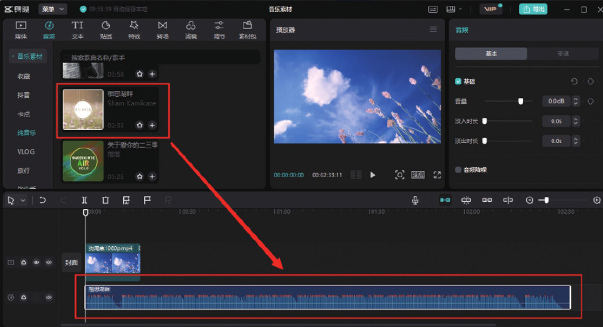
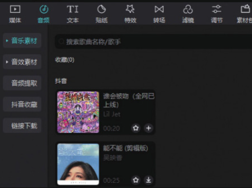
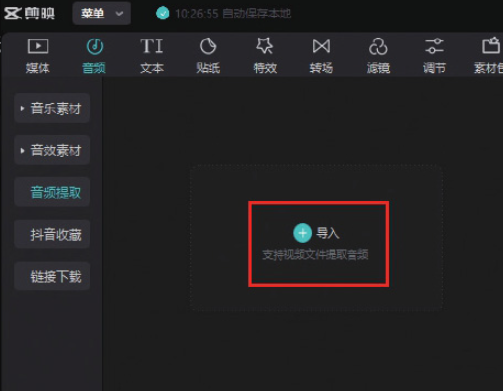
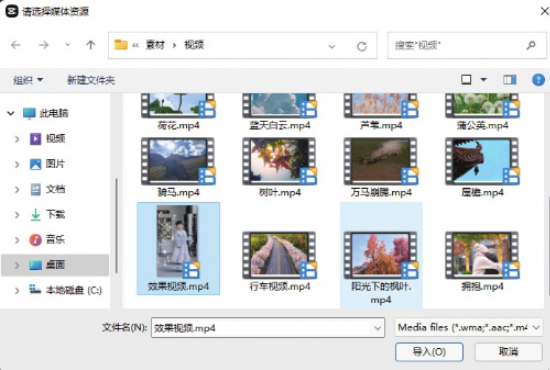
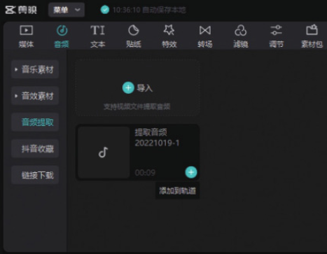
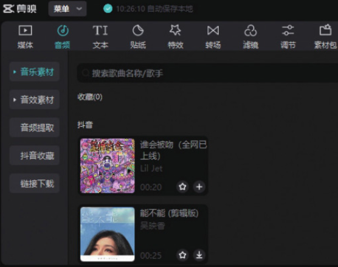
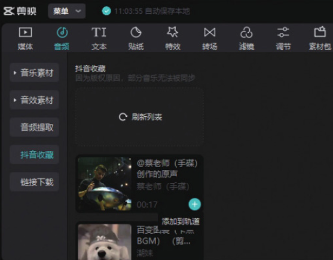

剪映专业版的“音频”功能按钮位于工具栏中，当用户在工具栏中单击“音频”按钮后，即可在音频选项栏中看到“音乐素材”​“音效素材”​“音频提取”​“抖音收藏”​“链接下载”5 个选项。

## 1. 音乐素材

打开剪映专业版软件，在剪辑项目中添加视频素材并将其添加到时间轴中。然后在工具栏中单击“音频”按钮，即可在默认的“音乐素材”选项栏中看到打开的音乐素材列表，如图 4-28 所示。用户可以在列表中选择不同类型的音乐素材进行试听，如图 4-29 所示。




如果需要将音乐素材添加至剪辑项目中，只需按住鼠标左键，将需要使用的音乐素材拖入时间轴中即可，如图 4-30 所示。



```
添加音效素材与添加音乐素材的操作方法一致，在“音频”功能区单击“音效素材”按钮，切换至“音效素材”选项栏，按住鼠标左键，将需要使用的音效素材拖入时间轴中即可。
```

## 2. 音频提取

打开剪映专业版软件，在剪辑项目中添加视频素材并将其添加到时间轴中。然后在工具栏中单击“音频”按钮，再单击“音乐素材”按钮，将音乐素材列表隐藏，如图 4-31 所示。接着单击“音频提取”按钮，在音频提取界面单击“导入”按钮，如图 4-32 所示。




在打开的“请选择媒体资源”对话框中打开素材所在的文件夹，选择需要使用的图像或视频素材，选择完成后单击“导入”按钮，如图 4-33 所示。



操作完成后，单击音频素材上的“添加到轨道”按钮，如图 4-34 所示，即可将提取的音频素材添加至剪辑项目中。



## 3. 抖音收藏

打开抖音 App，在视频播放界面点击界面右下角 CD 形状的按钮，如图 4-35 所示，进入“拍同款”界面，点击“收藏”按钮，即可收藏该视频的背景音乐，如图 4-36 和图 4-37 所示。


打开剪映专业版软件，登录抖音账号，在剪辑项目中添加视频素材并将其添加到时间轴中。在工具栏中单击“音频”按钮，再单击“音乐素材”按钮，将音乐素材列表隐藏，如图 4-38 所示。



单击“抖音收藏”按钮，即可看到刚刚在抖音 App 中收藏的音乐，单击“添加到轨道”按钮，如图 4-39 所示，即可将该音乐添加至剪辑项目中。


