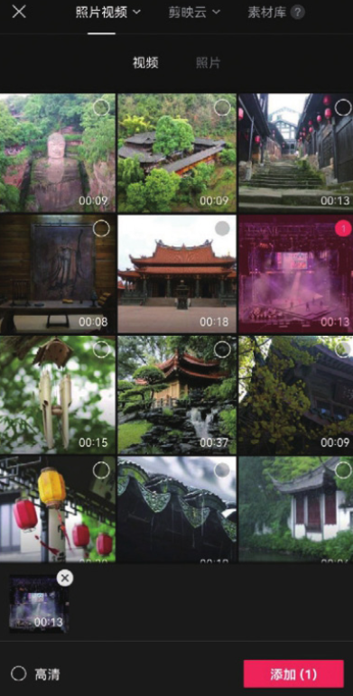
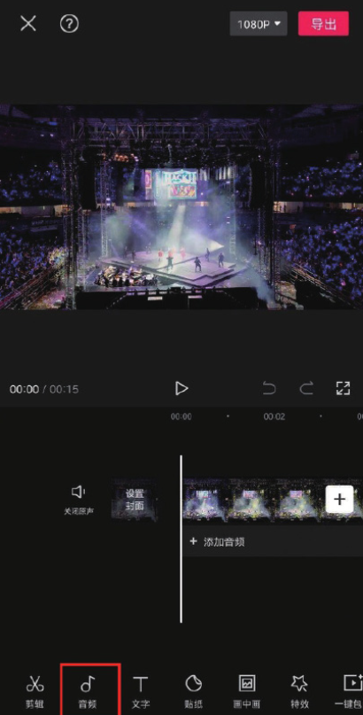
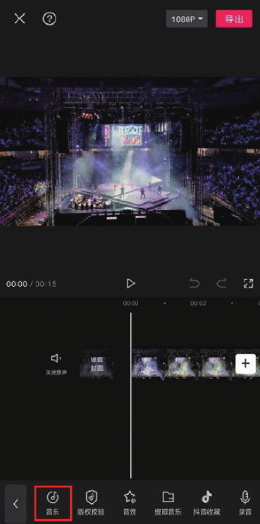
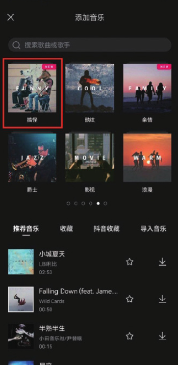
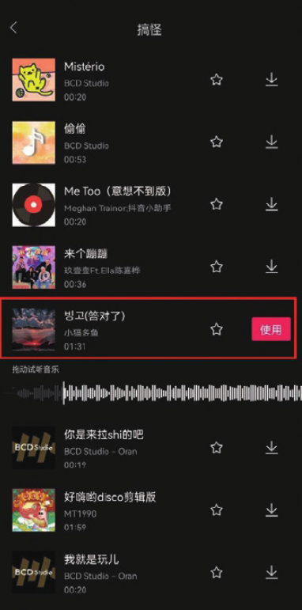
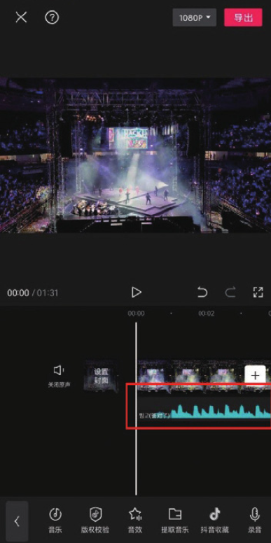
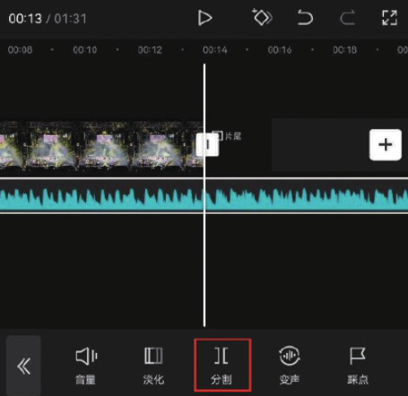
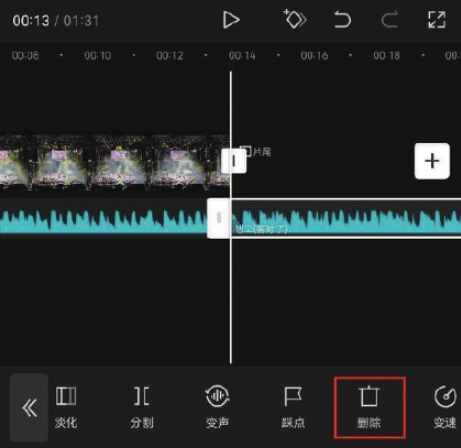
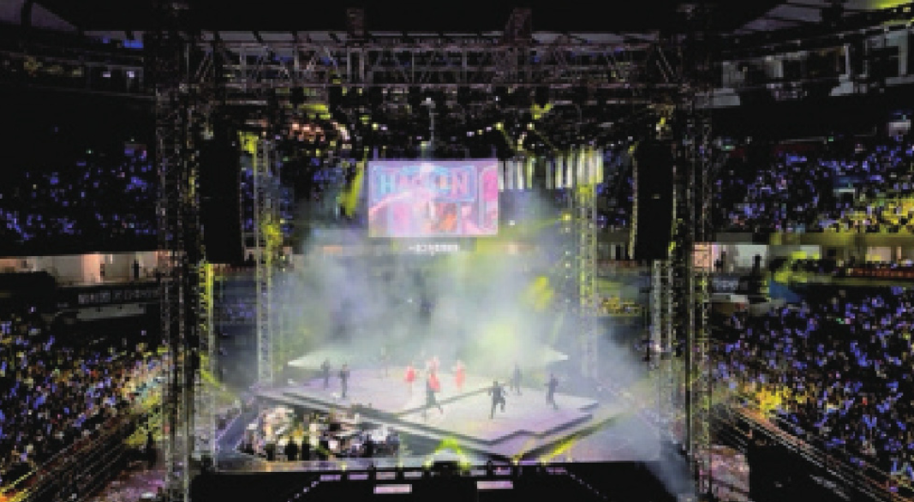

本案例介绍的是动感舞台效果的制作方法，主要使用剪映的“音乐”和“分割”功能。下面介绍具体的操作方法。

01 打开剪映 App，在主界面点击“开始创作”按钮，进入素材添加界面，切换至“视频”选项，选择一段“跳舞”的视频素材，点击“添加”按钮，如图 4-40 所示；进入视频编辑界面，点击底部工具栏中的“音频”按钮，如图 4-41 所示。

02 在音频选项栏中点击“音乐”按钮，如图 4-42 所示，进入剪映音乐素材库，选择“搞怪”选项，如图 4-43 所示。

03 在搞怪音乐列表中，选择图 4-44 所示的音乐，点击“使用”按钮，即可将该音乐添加至剪辑项目中，如图 4-45 所示。

04 将时间线移动至视频的结尾处，选中音乐素材，点击底部工具栏中的“分割”按钮，再点击“删除”按钮，将多余的音乐素材删除，如图 4-46 和图 4-47 所示。

05 点击界面右上角的“导出”按钮，将视频保存至相册，效果如图 4-48 所示。

