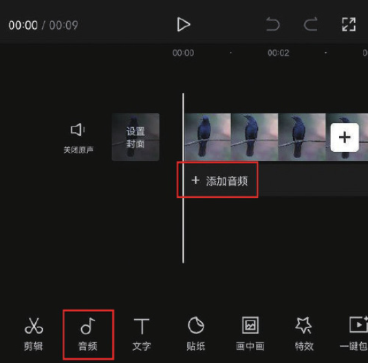
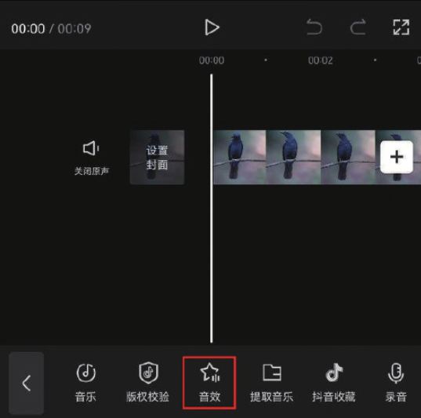
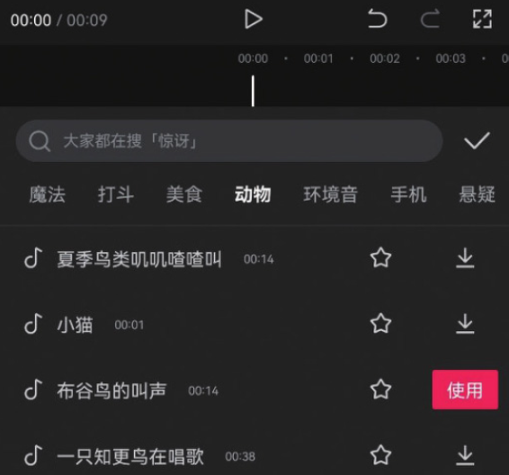
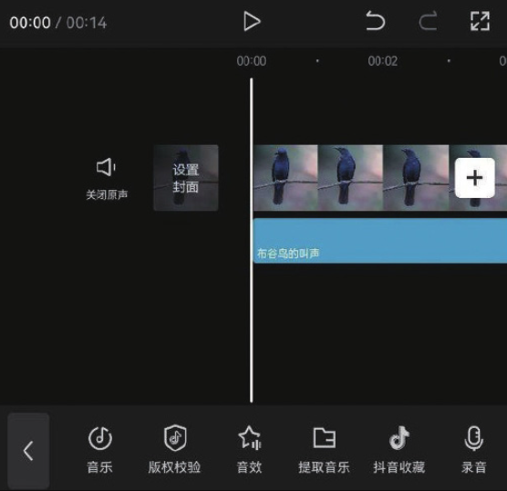

在视频中添加和画面内容相符的音效，可以大幅增强视频的代入感，让观众更有沉浸感。剪映自带的音效资源非常丰富，其添加方法与添加背景音乐的方法类似。

将时间线移动至需要添加音效的时间点，在未选中素材的状态下，点击“添加音频”按钮，或点击底部工具栏中的“音频”按钮，然后在打开的音频选项栏中点击“音效”按钮，如图 4-49 和图 4-50 所示。

完成上述操作后，即可打开音效选项栏，如图 4-51 所示，里面有魔法、美食、动物、环境音等不同类别的音效。添加音效素材的方法与上述添加音乐素材的方法一致，选择任意一个音效素材，点击右侧的“使用”按钮，即可将该音效添加至剪辑项目中，如图 4-52 所示。

