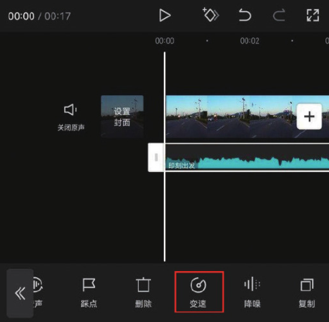
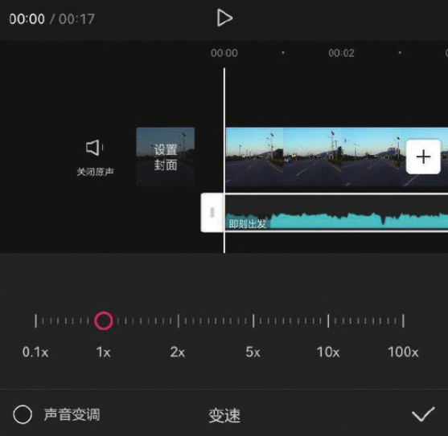

在进行视频编辑时，为音频进行恰到好处的变速处理，可以很好地增强视频的趣味性。

实现音频变速的操作非常简单，在时间轴中选中音频素材，然后点击底部工具栏中的“变速”按钮，如图 4-53 所示，在打开的“变速”选项栏中可以自由调节音频素材的播放速度，如图 4-54 所示。

在“变速”选项栏中左右拖动速度滑块，可以对音频素材进行减速或加速处理。速度滑块停留在 1x 数值处时，代表此时音频以正常速度播放。当用户向左拖动滑块时，音频素材将减速，且素材持续时长会变长；当用户向右拖动滑块时，音频素材将加速，且素材的持续时长将变短。

在进行音频变速操作时，如果想对音频的声音进行变调处理，可以选中左下角的“声音变调”选项，操作完成后，视频的声音会发生改变。
