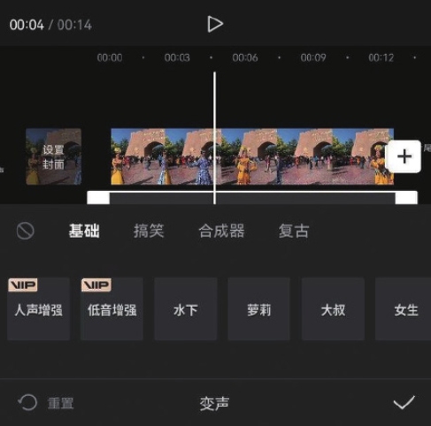

看过游戏直播的用户应该知道，很多平台主播为了提升直播人气，会使用变声软件进行变声处理，搞怪的声音配上幽默的话语，时常能引得观众捧腹大笑。

对视频原声进行变声处理，在一定程度上可以强化人物的情绪，对于一些趣味性或恶搞类短视频来说，音频变声可以很好地增强这类视频的幽默感。

使用“录音”功能完成旁白的录制后，在时间轴中选中音频素材，点击底部工具栏中的“变声”按钮，如图 4-55 所示。在打开的“变声”选项栏中可以根据实际需求选择声音效果，如图 4-56 所示。

