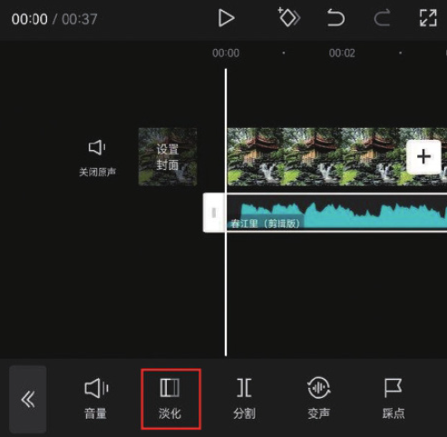
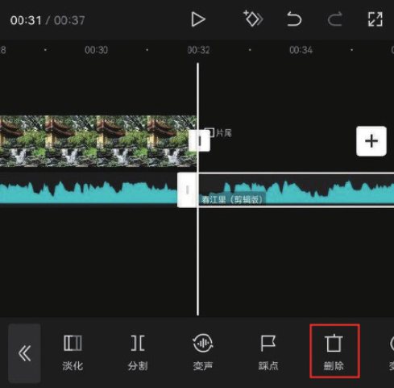
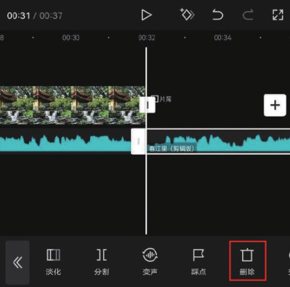
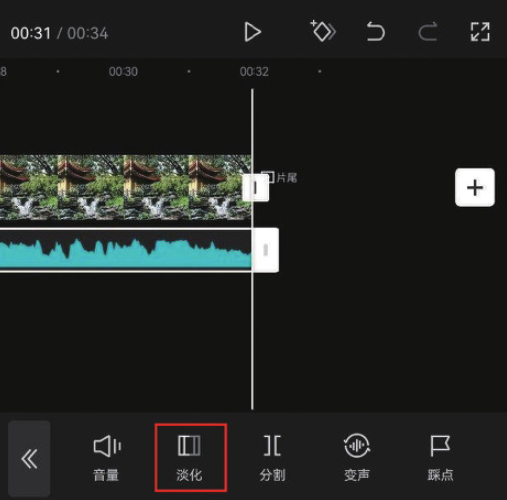
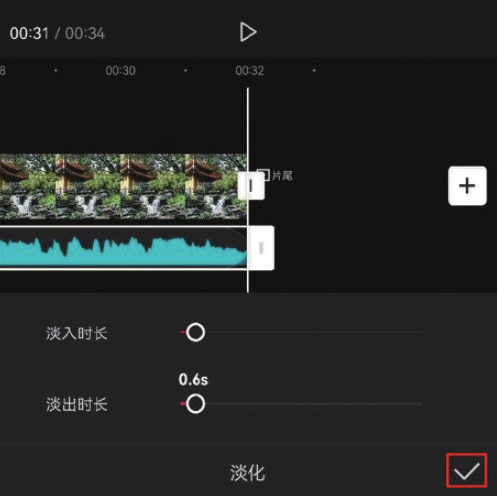

对于一些没有前奏和尾声的音频素材，在其前后添加淡化效果，可以有效降低音乐出入场时的突兀感；而在两个衔接音频之间添加淡化效果，可以令音频之间的过渡更加自然。

在轨道区域选中音频素材，点击底部工具栏中的“淡化”按钮，如图 4-57 所示，在底部选项栏中滑动“淡入时长”滑块，将数值调整为 0.6s，点击右下角的按钮保存，如图 4-58 所示。



将时间线移动至视频的结尾处，选中音频素材，点击底部工具栏中的“分割”按钮，再点击“删除”按钮，将多余的音频素材删除，如图 4-59 和图 4-60 所示。




在时间轴中选中音频素材，点击底部工具栏中的“淡化”按钮，如图 4-61 所示，在底部选项栏中滑动“淡出时长”滑块，将数值调整为 0.6s，点击右下角的按钮保存，如图 4-62 所示。




```
淡入是指背景音乐开始播放的时候，声音会缓缓变大；淡出是指背景音乐即将结束的时候，声音会逐渐减小直至消失。
```
