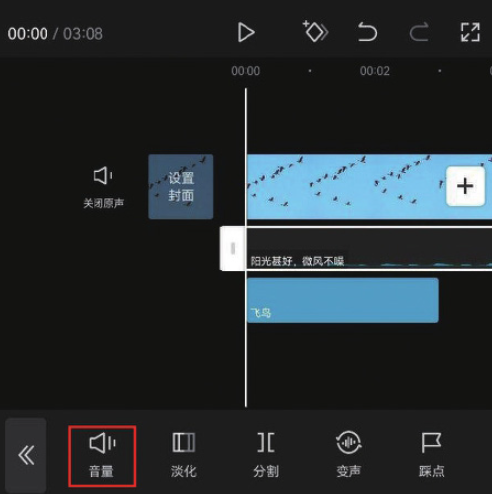
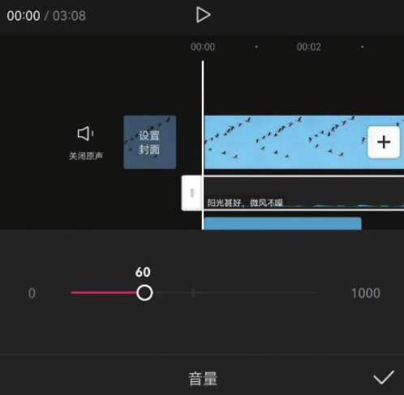
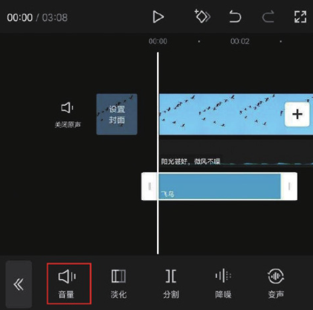
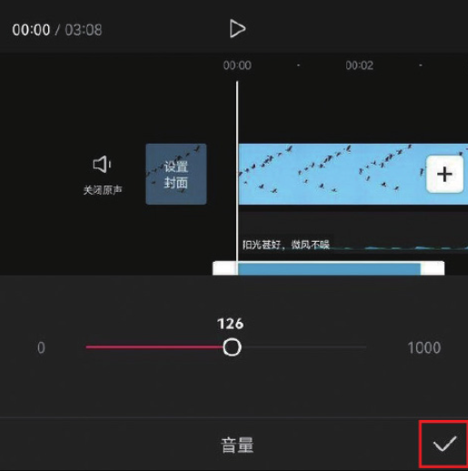
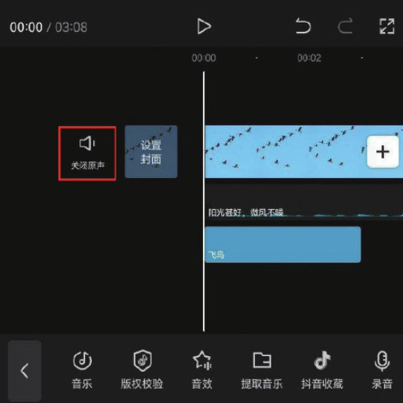

为一段视频添加背景音乐、音效或者配音后，时间轴中会出现多条音频轨道。想让视频的声音更有层次感，可以单独调节其音量。

在时间轴中选中需要调节音量的轨道，此处选择的是背景音乐轨道，点击底部工具栏中的“音量”按钮，如图 4-63 所示。

拖动音量滑块，即可设置所选音频的音量。默认音量为 100，此处适当降低背景音乐的音量，将其调整为 60，点击右下角的按钮保存，如图 4-64 所示。

选中音效轨道，并点击底部工具栏中的“音量”按钮，如图 4-65 所示。适当增加音效的音量，此处将其调节为 126，点击右下角的按钮保存，如图 4-66 所示。

使用这种方法可单独调整音轨音量，让声音更具有层次感。

需要强调的是，如果视频素材本身就有声音，当用户想关闭视频原声时，可以在时间轴中点击“关闭原声”按钮，如图 4-67 所示。

