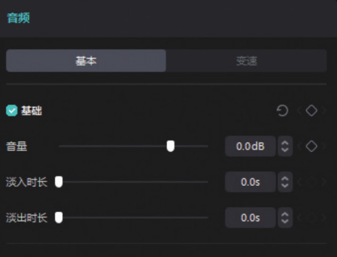
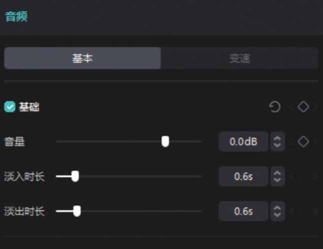
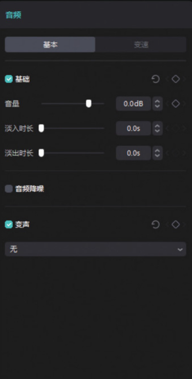
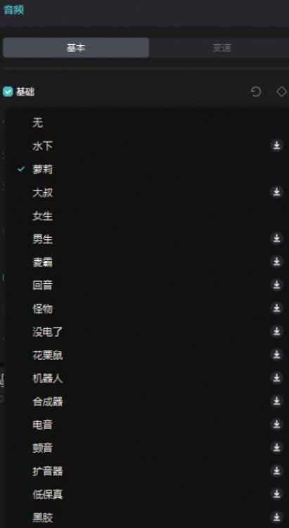
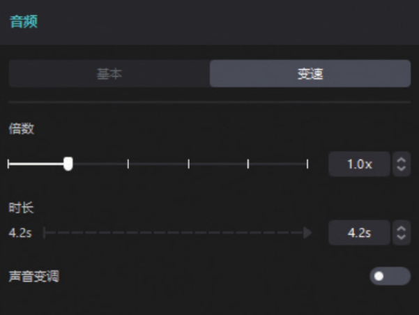

在剪辑项目中添加音乐素材后，在时间轴中选中素材，素材调整区将自动切换至“音频”功能区，用户可在该区域对音频进行淡化、变声、变速等处理。

## 1. 音频淡化

在时间轴中选中音频素材后，即可在界面右上角的“音频”功能区看到“淡入时长”与“淡出时长”滑块，如图 4-68 所示，用户可以通过拖动滑块自行设置音频的淡入时长和淡出时长，如图 4-69 所示。




```
如需调整音频的音量，可以拖动“淡入时长”滑块上方的“音量”滑块。将滑块往右拖动，数值将变大，声音随之变大；将滑块往左拖动，数值将变小，声音会随之变小。
```

## 2. 音频变声

在时间轴中选中音频素材，在界面右上角的“音频”功能区勾选“变声”复选框，如图 4-70 所示。然后单击“无”选项右侧的下拉按钮，即可展开“变声”选项的下拉列表，用户可以根据实际需求选择声音效果，如图 4-71 所示。




## 3. 音频变速

在时间轴中选中音频素材，在界面右上角的“音频”功能区单击“变速”按钮，切换至“变速”选项栏，如图 4-72 所示。用户可以在“变速”选项栏中通过左右拖动“倍数”滑块，对音频素材进行减速或加速处理。



当“倍数”滑块停留在 1.0x 数值处时，代表此时音频以正常速度播放。当用户向左拖动滑块时，音频素材将减速，且素材时长会变长；当用户向右拖动滑块时，音频素材将加速，且素材时长将变短。

在进行变速处理时，如果想对音频进行变调处理，可以单击打开下方的“声音变调”开关，操作完成后，音频素材的声音将会发生改变。
