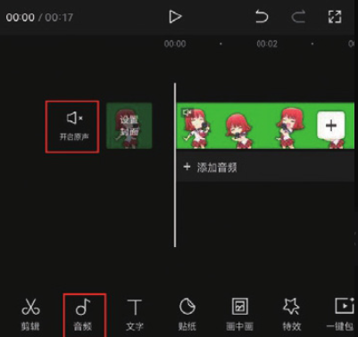
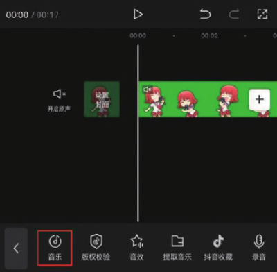
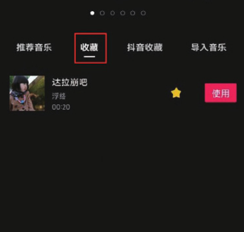
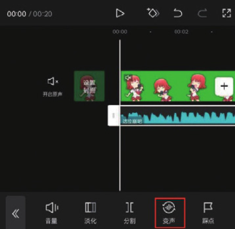
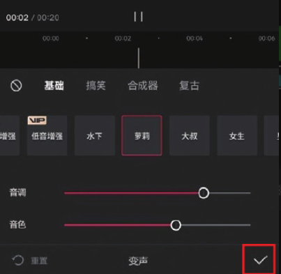
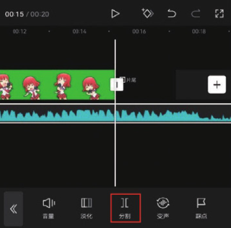
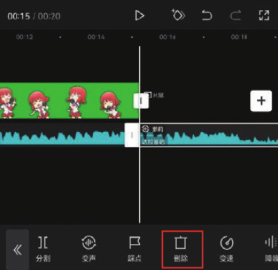
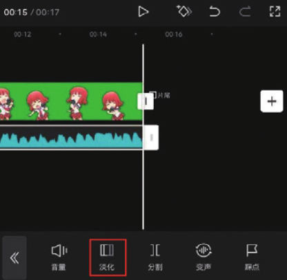
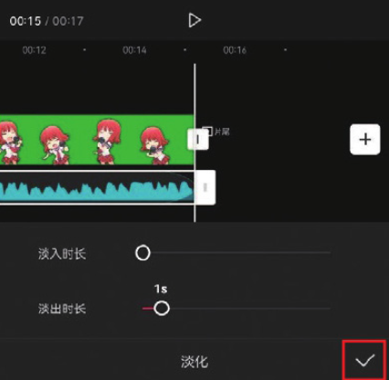

本案例介绍的是魔幻歌声的制作方法，主要使用剪映的“音乐”和“变声”功能。下面介绍具体的操作方法。

01 从剪映的素材库中选择一段唱歌的绿幕素材，点击底部工具栏中的“音频”按钮，打开音频选项栏，点击“音乐”按钮，如图 4-73 和图 4-74 所示，进入剪映的音乐素材库，切换至“收藏”选项，选择图 4-75 所示的音乐，点击“使用”按钮。

02 在时间轴中选中音频素材，点击底部工具栏中的“变声”按钮，如图 4-76 所示，打开“变声”选项栏，选择“萝莉”效果，点击右下角的按钮保存，如图 4-77 所示。

03 将时间线移动至视频的结尾处，选中音乐素材，点击底部工具栏中的“分割”按钮，再点击“删除”按钮，将多余的音乐素材删除，如图 4-78 和图 4-79 所示。

04 在时间轴中选中音乐素材，点击底部工具栏中的“淡化”按钮，如图 4-80 所示，在底部选项栏中滑动“淡出时长”滑块，将数值设置为 1s，点击右下角的按钮保存，如图 4-81 所示。

05 点击界面右上角的“导出”按钮，将视频保存至相册，效果如图 4-82 所示。
