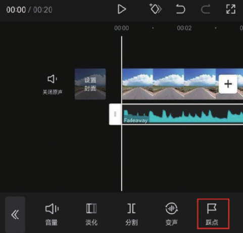
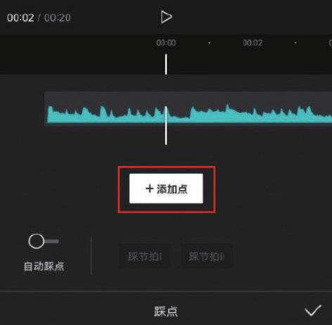
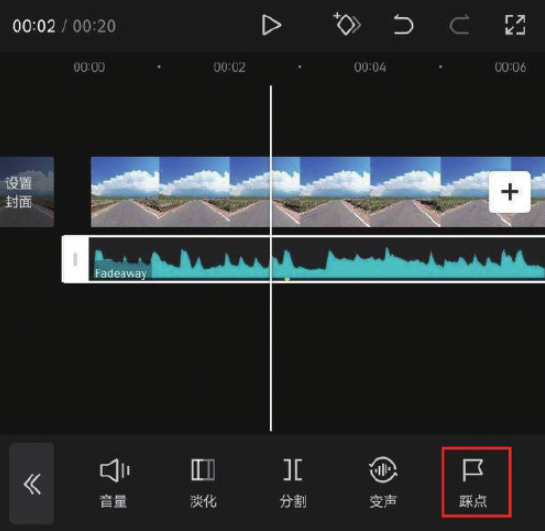
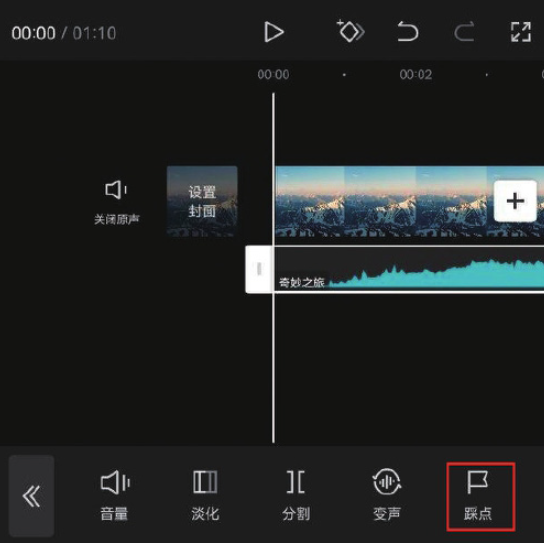
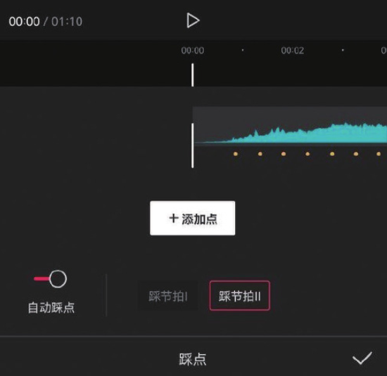

以往使用视频剪辑软件制作卡点视频时，往往需要一边试听音频效果，一边手动标记节奏点，可以说是一项既费时又费力的事情，因此制作卡点视频让很多新手望而却步。剪映针对新手用户推出了特色“踩点”功能，不仅支持用户手动标记节奏点，还能帮助用户快速分析背景音乐，自动生成节奏标记点。

## 1. 手动卡点

在时间轴中添加音乐素材后，选中音乐素材，点击底部工具栏中的“踩点”按钮，如图 4-83 所示。在打开的“踩点”选项栏中，将时间线移动至需要进行标记的时间点，然后点击“添加点”按钮，如图 4-84 所示。

完成上述操作后，即可在时间线所在的位置添加一个黄色的标记，如图 4-85 所示。如果对添加的标记不满意，点击“删除点”按钮即可将标记删标记点添加完成后，点击按钮即可保存，此时在轨道区域可以看到刚刚添加的标记点，如图 4-86 所示，根据标记点所处位置可以轻松地对视频进行剪辑，完成卡点视频的制作。

## 2. 自动卡点

在时间轴中添加音乐素材后，选中音乐素材，点击底部工具栏中的“踩点”按钮，如图 4-87 所示。在打开的踩点选项栏中点击“自动踩点”按钮，将“自动踩点”功能打开，用户可以根据自己的需求选择“踩节拍 Ⅰ”或“踩节拍 Ⅱ”选项，完成选择后点击按钮保存，此时音乐素材下方会自动生成黄色的标记点，如图 4-88 所示。

