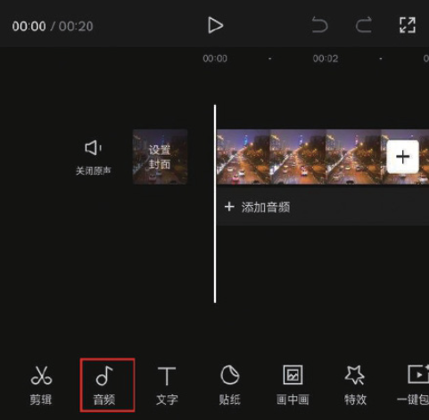
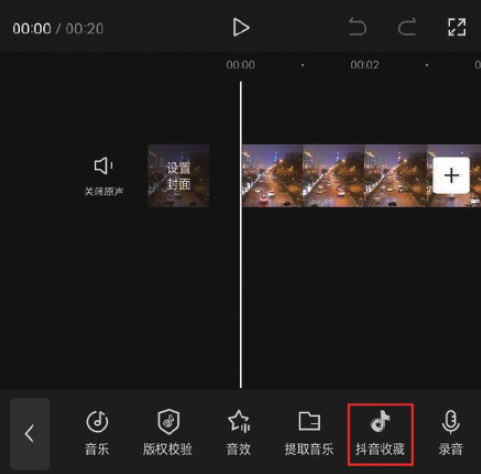
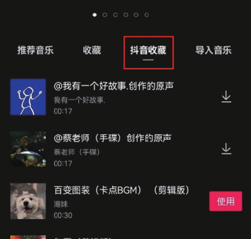
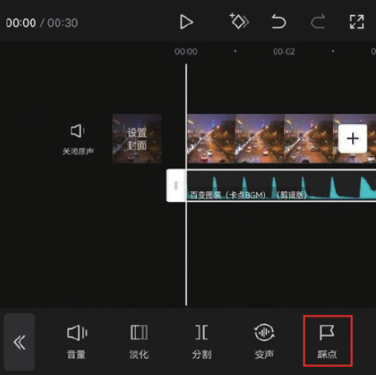
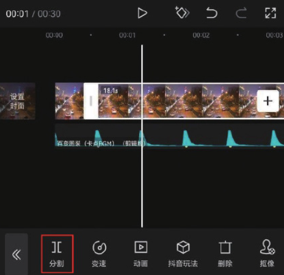
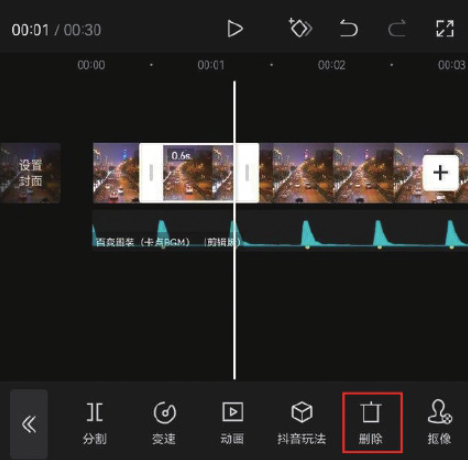

所谓抽帧，其实就是将视频中的一部分画面删除。当删除推镜或者拉镜视频中的一部分画面时，就会形成景物突然放大或缩小的效果。这种效果随着音乐的节拍出现，就是抽帧卡点效果了，具体操作方法如下。

首先，在剪映中添加一段视频素材，点击底部工具栏中的“音频”按钮，打开音频选项栏，点击“抖音收藏”按钮，如图 4-89 和图 4-90 所示。

在“抖音收藏”音乐列表中选择一首自己喜欢的卡点音乐，点击“使用”按钮，如图 4-91 所示。在时间轴中选中音乐素材，点击底部工具栏中的“踩点”按钮，如图 4-92 所示。

在“踩点”选项栏中点击“自动踩点”按钮，选择“踩节拍 Ⅱ”选项，点击右下角的按钮保存，如图 4-93 所示。将时间线移动至第 1 个节拍点所在的位置，选中视频素材，点击底部工具栏中的“分割”按钮，如图 4-94 所示。

将中间的片段删除后，两个视频会直接衔接起来，如图 4-97 所示，这样就有了抽帧效果。
