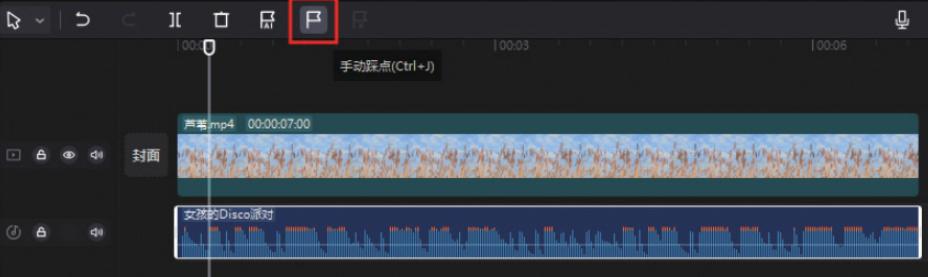
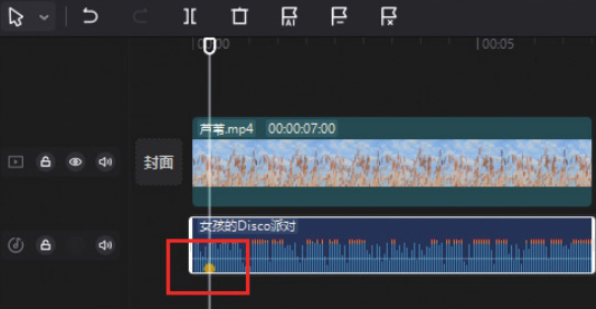
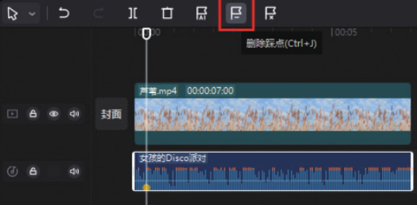
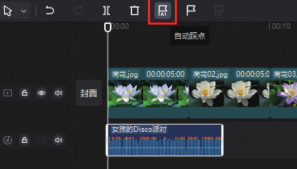
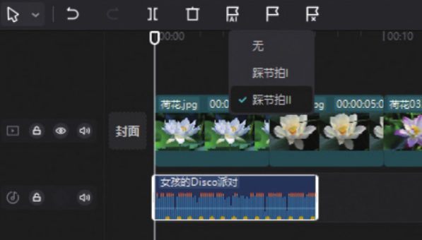

剪映专业版的“踩点”功能按钮位于常用功能区，在时间轴中选中音频素材后，即可在常用功能区看到“自动踩点”和“手动踩点”功能按钮。

## 1. 手动踩点

在时间轴中添加音乐素材后，选中音乐素材，将时间线移动至需要进行标记的时间点，然后单击“手动踩点”按钮，如图 4-98 所示。



完成上述操作后，即可在时间线所在的位置添加一个黄色的标记，如图 4-99 所示。如果对添加的标记不满意，可单击“删除踩点”按钮将标记删除，如图 4-100 所示。




```
单击“删除踩点”按钮可将选中的某一个标记点删除，而单击“清除踩点”按钮可将音频素材上的所有标记点清除。
```

## 2. 自动踩点

在时间轴中添加多段素材后，选中音乐素材，然后在常用功能区单击“自动踩点”按钮，如图 4-101 所示，打开“自动踩点”下拉列表，用户可以根据自己的需求选择“踩节拍 Ⅰ”或“踩节拍 Ⅱ”选项，完成选择后，音乐素材下方会自动生成黄色的标记点，如图 4-102 所示。




完成音乐的踩点操作之后，可根据节拍点调整素材的持续时长，使两段素材之间的衔接点正好位于音乐的节拍点位置，如图 4-103 所示，从而形成画面根据音乐的节奏而变化的效果。
