本案例介绍的是动画转场卡点短视频的制作方法，主要使用剪映的“踩点”和“动画”功能。下面介绍具体的操作方法。

01 打开剪映 App，在主界面点击“开始创作”按钮，进入素材添加界面，切换至“视频”选项，依次选择 24 段“城市夜景”视频素材，点击“添加”按钮，如图 4-104 所示。进入视频编辑界面，点击底部工具栏中的“音频”按钮，如图 4-105 所示。

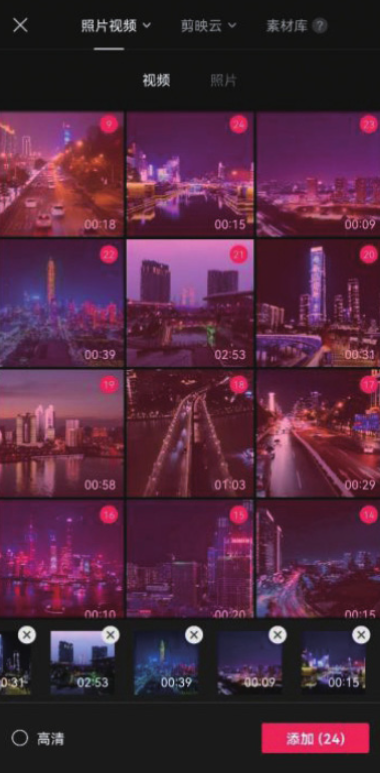
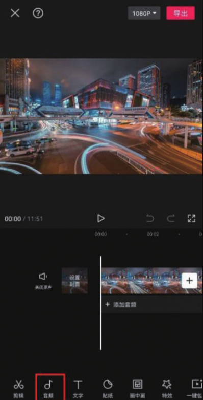

02 在音频选项栏中点击“抖音收藏”按钮，如图 4-106 所示，选择图 4-107 所示的音乐，点击“使用”按钮。

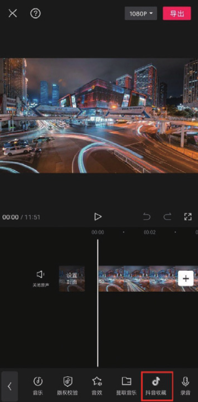
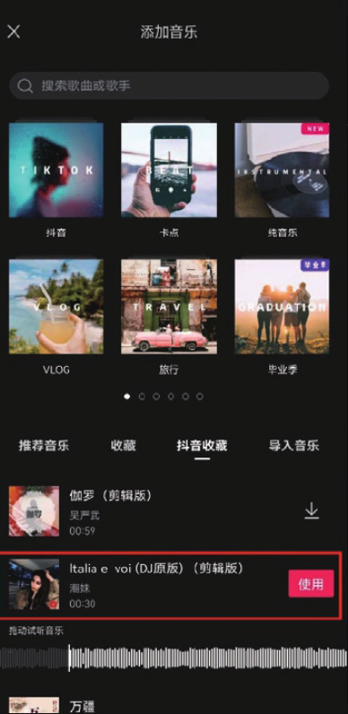

03 在时间轴中选中音乐素材，点击底部工具栏中的“踩点”按钮，如图 4-108 所示。在“踩点”选项栏中点击“自动踩点”按钮，选择“踩节拍 Ⅱ”选项，点击按钮保存，如图 4-109 所示。

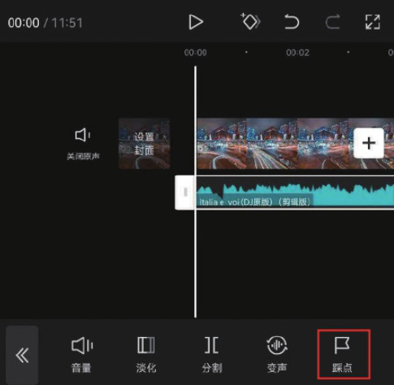
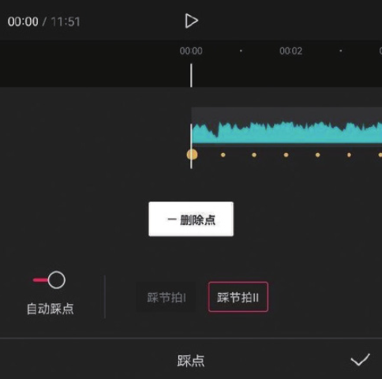

04 将时间线移动至第 2 个节拍点所在的位置，选中第 1 段素材，点击底部工具栏中的“分割”按钮，再点击“删除”按钮，将多余的素材删除，如图 4-110 和图 4-111 所示。

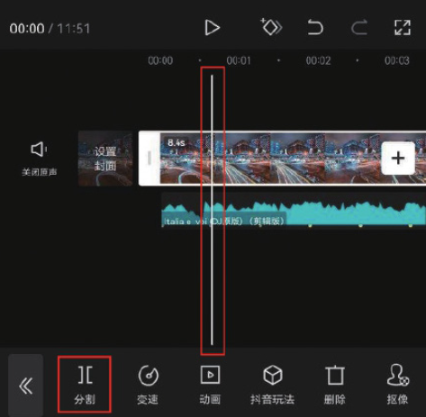
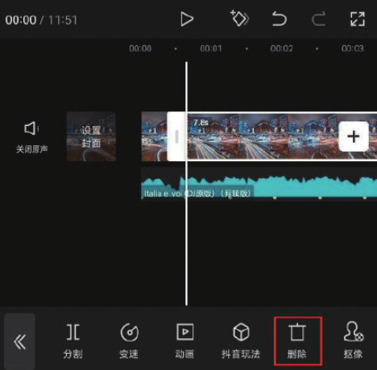

05 参照步骤 04 的操作方法，根据音乐素材上的节拍点对余下的视频素材进行处理，如图 4-112 所示；选中第 1 段素材，点击底部工具栏中的“动画”按钮，如图 4-113 所示。

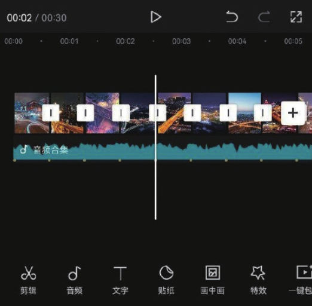
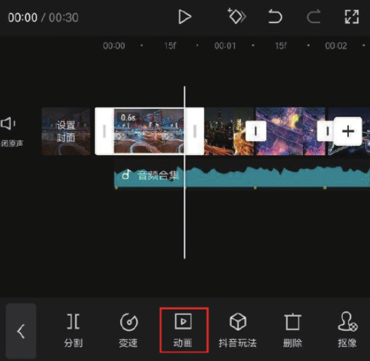

06 打开动画选项栏，点击“入场动画”按钮，如图 4-114 所示，在“入场动画”选项栏中选择“动感放大”效果，点击右下角的按钮保存，如图 4-115 所示。

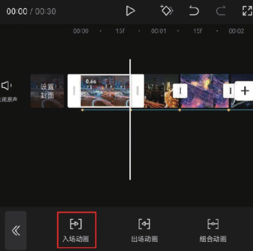
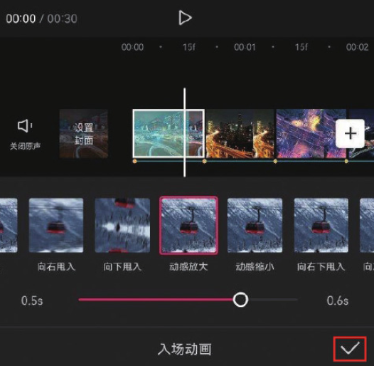

07 参照步骤 06 的操作方法，为余下的素材添加自己喜欢的入场动画效果。将时间线移动至视频的结尾处，选中音乐素材，点击底部工具栏中的“分割”按钮，再点击“删除”按钮，将多余的音乐素材删除，如图 4-116 和图 4-117 所示。

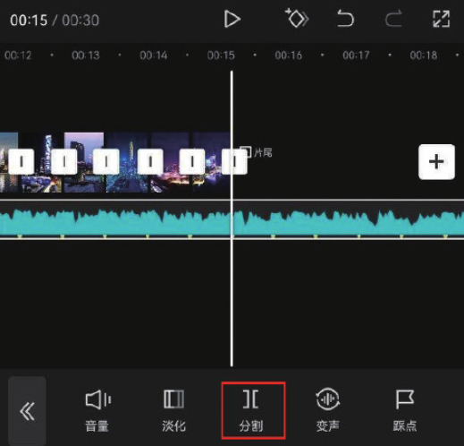
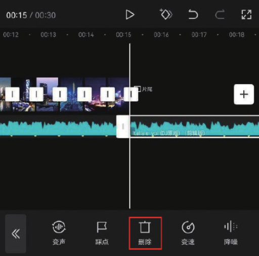

08 在时间轴中选中片尾，点击底部工具栏中的“删除”按钮，将剪映自带的片尾去除，如图 4-118 和图 4-119 所示。

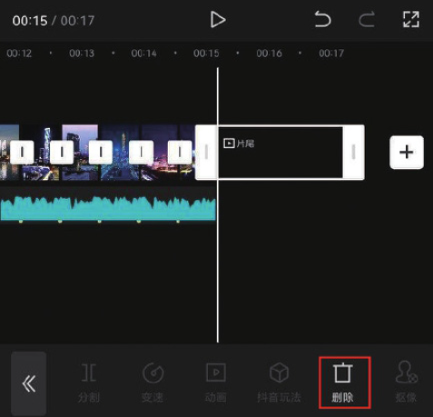
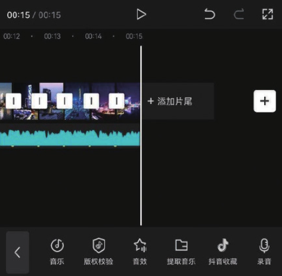

09 点击界面右上角的“导出”按钮，将视频保存至相册，效果如图 4-120 和图 4-121 所示。

