本案例介绍的是关键帧卡点短视频的制作方法，主要使用剪映的“踩点”和关键帧功能。下面介绍具体的操作方法。

01 打开剪映 App，在主界面点击“开始创作”按钮，进入素材添加界面，切换至“视频”选项，依次选择 17 段“人物背影”视频素材，点击“添加”按钮，如图 4-122 所示。进入视频编辑界面，点击底部工具栏中的“音频”按钮，如图 4-123 所示。

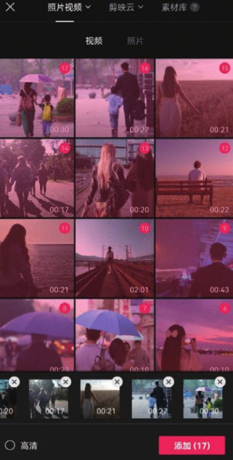
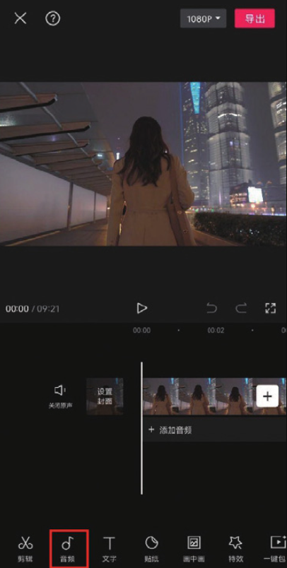

02 在音频选项栏中点击“抖音收藏”按钮，如图 4-124 所示，选择图 4-125 所示的音乐，点击“使用”按钮。

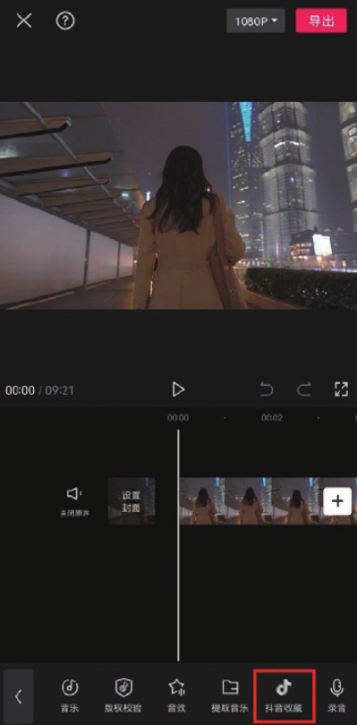
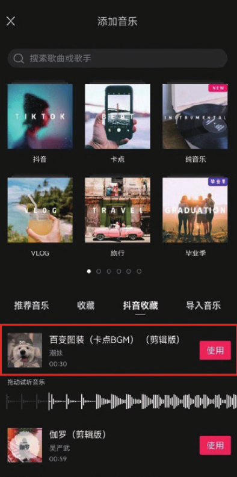

03 在时间轴中选中音乐素材，点击底部工具栏中的“踩点”按钮，如图 4-126 所示。在“踩点”选项栏中点击“自动踩点”按钮，选择“踩节拍 Ⅱ”选项，完成选择后点击右下角的按钮保存，如图 4-127 所示。

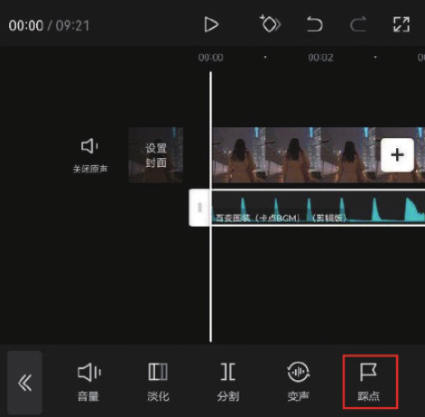
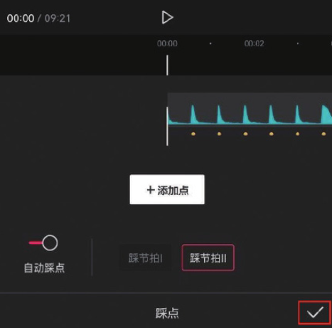

04 将时间线移动至第 2 个节拍点所在的位置，选中第 1 段素材，点击底部工具栏中的“分割”按钮，再点击“删除”按钮，将多余的素材删除，如图 4-128 和图 4-129 所示。

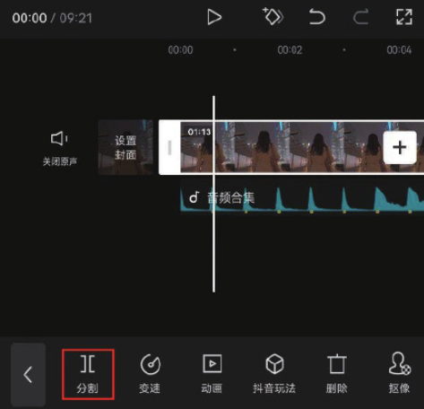
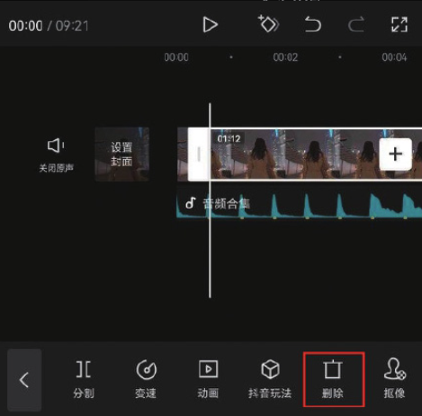

05 参照步骤 04 的操作方法，根据音乐素材上的节拍点对余下的视频素材进行处理。将时间线移动至视频的起始位置，选中第 1 段素材，在预览区捏合双指，将画面缩小，点击界面中的按钮，添加一个关键帧，如图 4-130 所示。

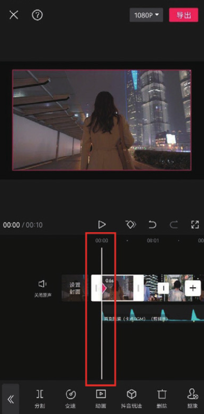

06 将时间线移动至第 1 段素材的结尾处，在预览区分开双指，将画面放大，此时剪映会自动在时间线所在的位置打上一个关键帧，如图 4-131 所示。

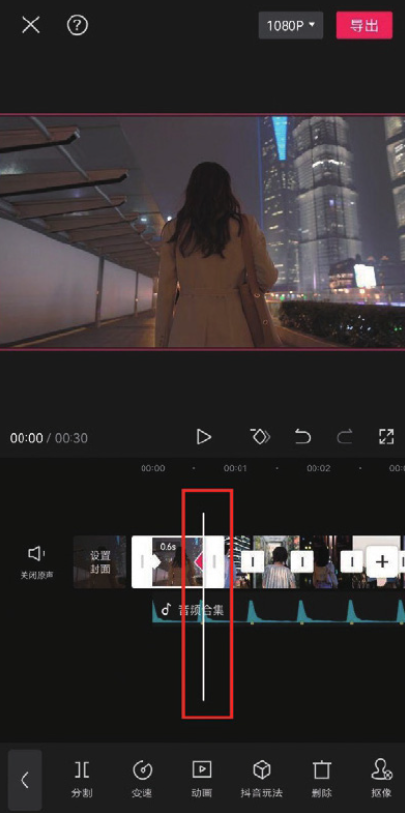

07 参照步骤 05 和步骤 06 的操作方法为第 2 至第 6 段素材添加关键帧。将时间线移动至第 7 段素材的起始位置，选中素材，点击界面中的按钮，添加一个关键帧，如图 4-132 所示。

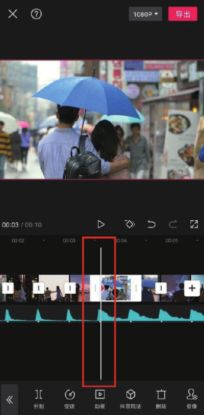

08 将时间线移动至第 7 段素材的结尾处，在预览区捏合双指，将画面缩小，此时剪映会自动在时间线所在的位置打上一个关键帧，如图 4-133 所示。

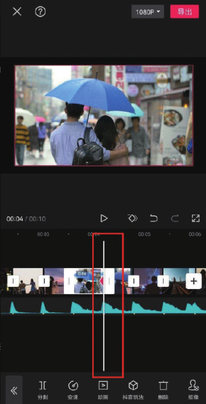

09 参照步骤 07 和步骤 08 的操作方法为第 7 至第 17 段素材添加关键帧。将时间线移动至视频的结尾处，选中音乐素材，点击底部工具栏中的“分割”按钮，再点击“删除”按钮，将多余的音乐素材删除，如图 4-34 和图 4-135 所示。

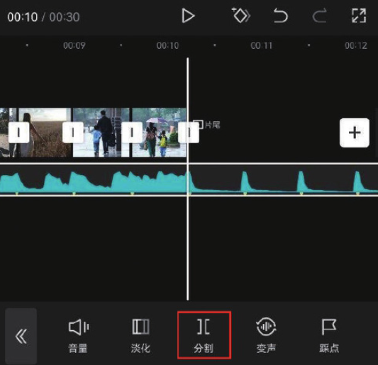
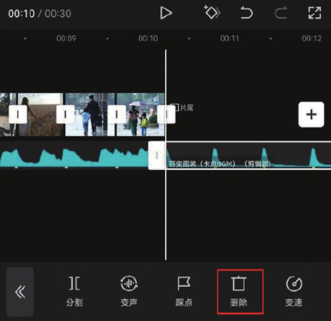

10 在时间轴中选中片尾，点击底部工具栏中的“删除”按钮，将剪映自带的片尾去除，如图 4-136 和图 4-137 所示。

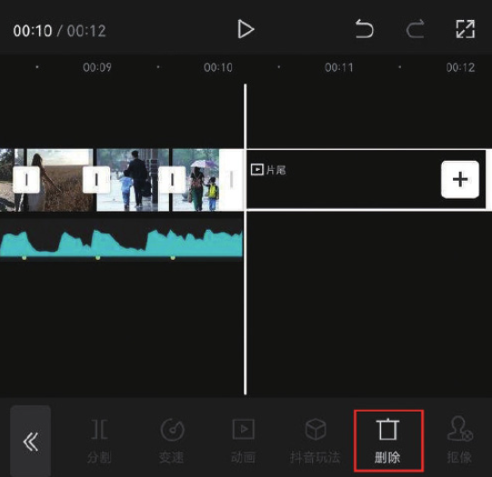
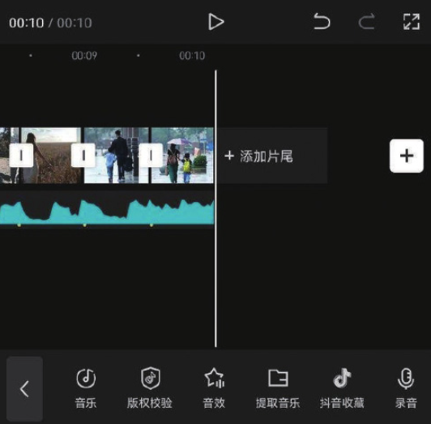

11 点击界面右上角的“导出”按钮，将视频保存至相册，效果如图 4-138 和图 4-139 所示。

