本案例介绍的是曲线变速卡点短视频的制作方法，主要使用剪映的“踩点”和“曲线变速”功能。下面介绍具体的操作方法。

1 打开剪映 App，在主界面点击“开始创作”按钮，进入素材添加界面，切换至“视频”选项，依次选择 17 段“古建筑”的视频素材，点击添加按钮，如图 4-140 所示。进入视频编辑界面，点击底部工具栏中“音频”按钮，如图 4-141 所示。

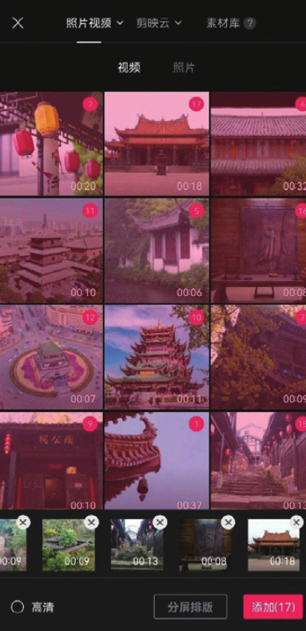
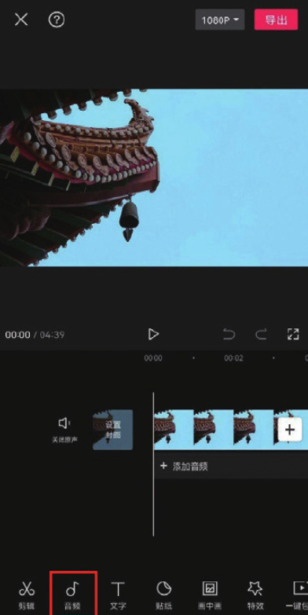

2 在音频选项栏中点击“抖音收藏”按钮，如图 4-142 所示，选择图-143 所示的音乐，点击“使用”按钮。

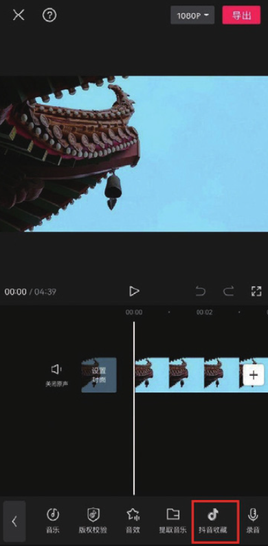
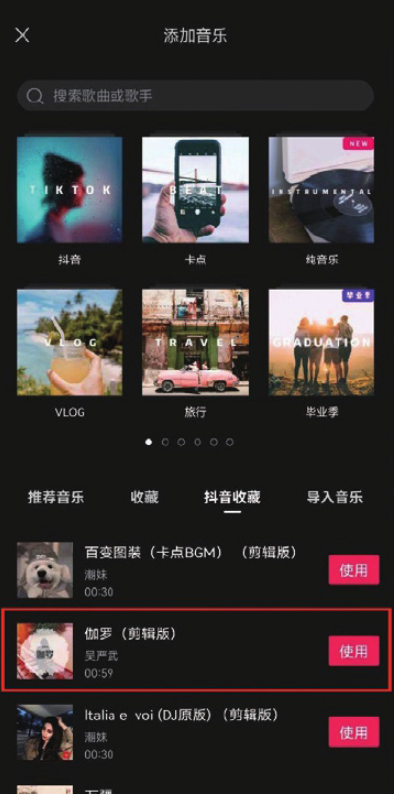

3 在时间轴中选中音乐素材，点击底部工具栏中的“踩点”按钮，如 4-144 所示。在“踩点”选项栏中点击“自动踩点”按钮，选择“踩节 Ⅱ”选项，如图 4-145 所示。

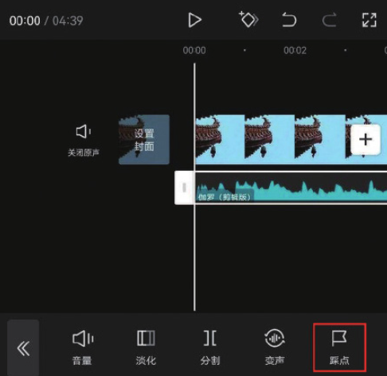
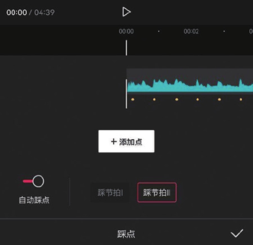

4 在“踩点”选项栏中分开双指，将音乐轨道拉长，点击“添加点”按钮，在音频素材的开端根据音乐节拍手动添加 5 个节拍点，添加完成后点右下角的按钮保存，如图 4-146 所示。

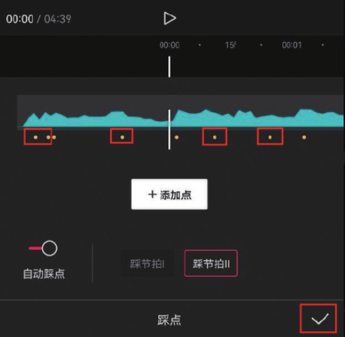

5 将时间线移动至第 1 个节拍点所在的位置，选中第 1 段素材，点击底部工具栏中的“分割”按钮，将素材一分为二，如图 4-147 所示。

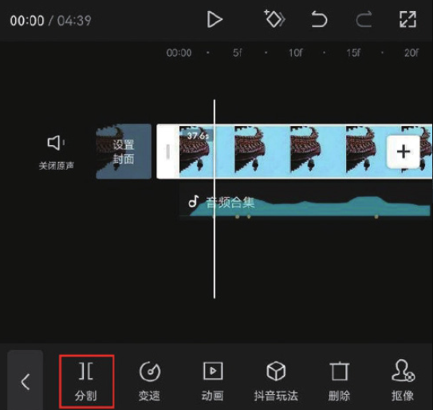

6 选中分割出来的后半段素材，点击底部工具栏中的“删除”按钮，其删除，如图 4-148 所示。参照上述操作方法，根据音乐素材的节拍点第 2 至第 8 段素材进行剪辑，如图 4-149 所示。

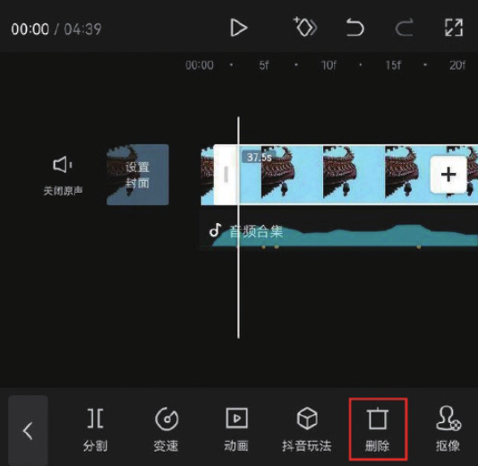
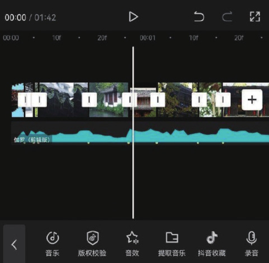

7 在时间轴中选中第 9 段素材，点击底部工具栏中的“变速”按钮，打示开变速选项栏，点击“曲线变速”按钮，如图 4-150 和图 4-151 所示。

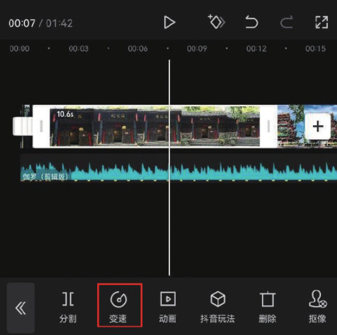
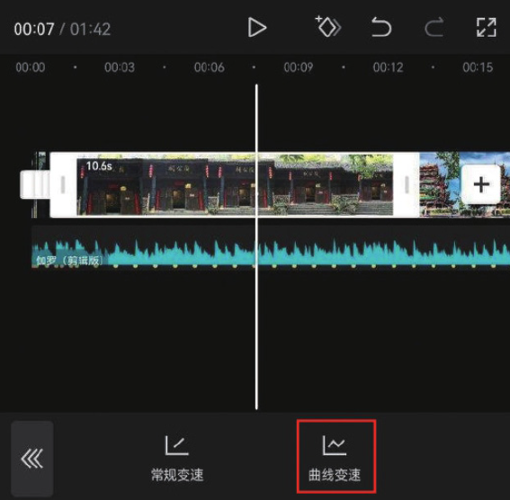

8 在打开的“曲线变速”选项栏中选择“自定”选项，在该图标变红后，再次点击图标中的“点击编辑”按钮，如图 4-152 和图 4-153 所示。

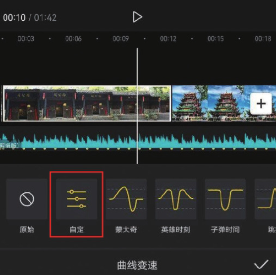
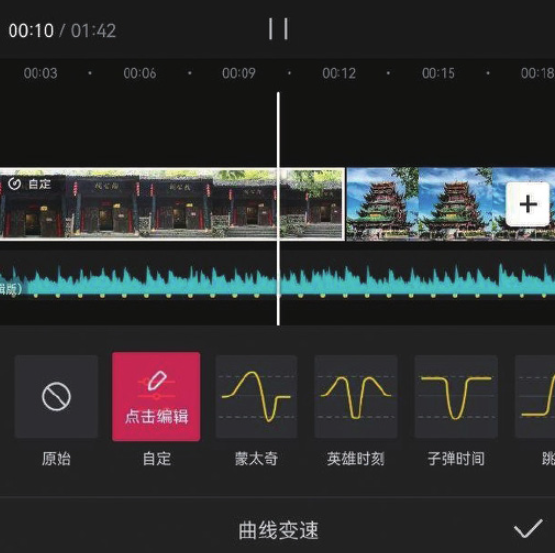

9 在曲线编辑面板中选中预设的锚点，点击“删除点”按钮，如图 4-54 所示。参照上述操作方法将面板中预设的 3 个锚点删除后，将第 1 个锚向上拖动至 6.6x 的位置，如图 4-155 所示。

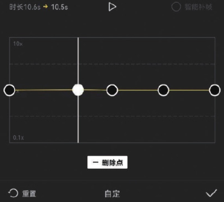
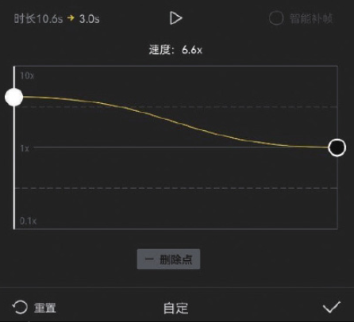

10 将时间线移动至慢动作画面开始的位置，点击“添加点”按钮，并将添加的锚点向下拖动至 1.3x 的位置，如图 4-156 和图 4-157 所示。

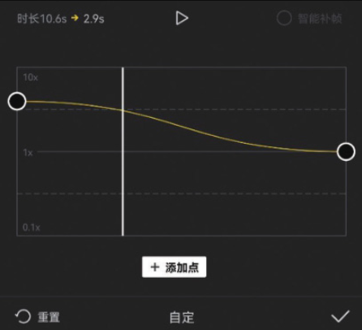
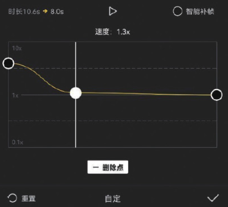

11 将时间线移动至慢动作画面结束的位置，点击“添加点”按钮，如图-158 所示，并将第 4 个锚点向上拖动至 6.6x 的位置，如图 4-159 所示。

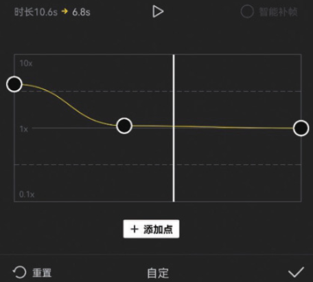
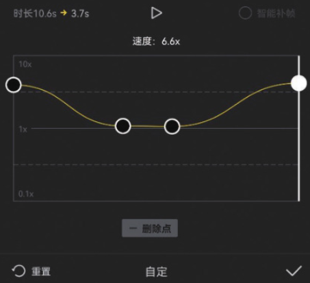

12 参照步骤 07 至步骤 11 的操作方法，为第 10 段至第 17 段素材添加曲线速效果。将时间线定位至第 9 段和第 10 段素材之间的位置，点击底部工栏中的“音效”按钮，如图 4-160 所示，打开音效选项栏，选择图 4-161 所示的转场音效，点击“使用”按钮。

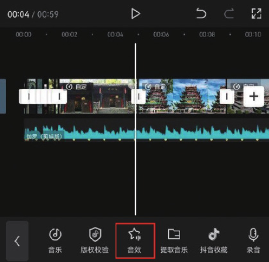
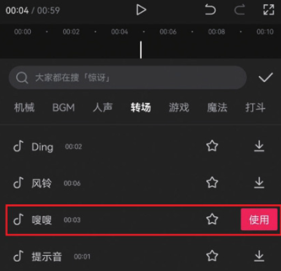

13 参照步骤 12 的操作方法，在第 13 段至第 14 段、第 14 段至第 15 段、第 5 段至第 16 段素材之间均添加上转场音效，如图 4-162 所示。将时间线移动至视频的结尾处，选中音乐素材，点击底部工具栏中的“分割”按钮，将音乐素材一分为二，如图 4-163 所示。

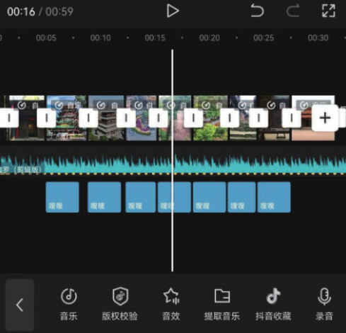
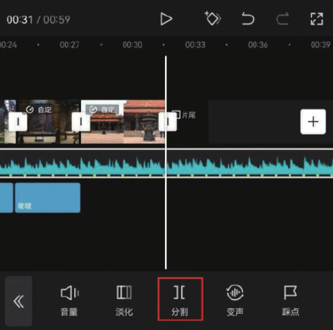

14 选中分割出来的后半段音乐素材，点击底部工具栏中的“删除”按钮，将其删除，如图 4-164 所示。

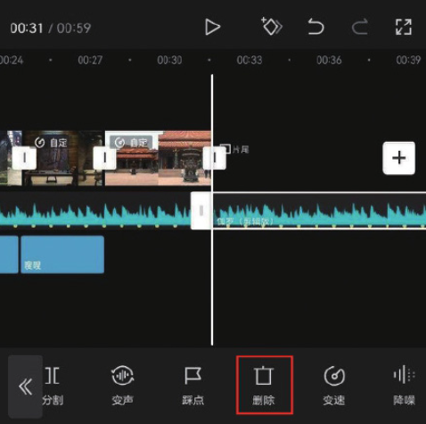

15 在时间轴中选中片尾，点击底部工具栏中的“删除”按钮，将剪映自带的片尾删除，如图 4-165 所示。

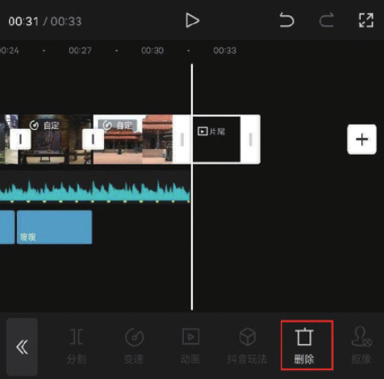

16 点击界面右上角的“导出”按钮，将视频保存至相册，效果如图 4-166 和图 4-167 所示。

