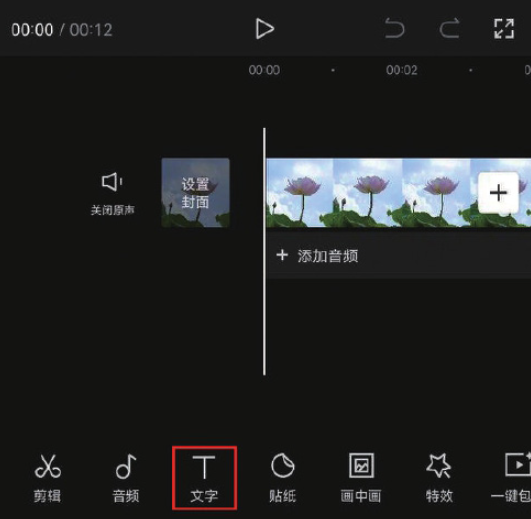
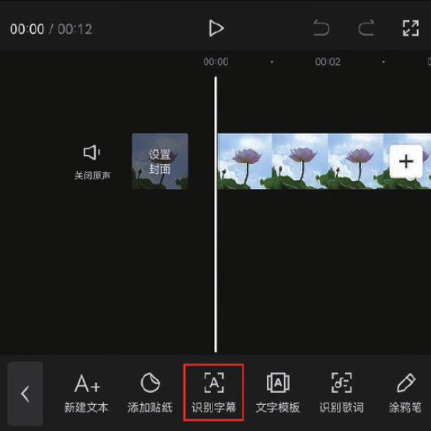
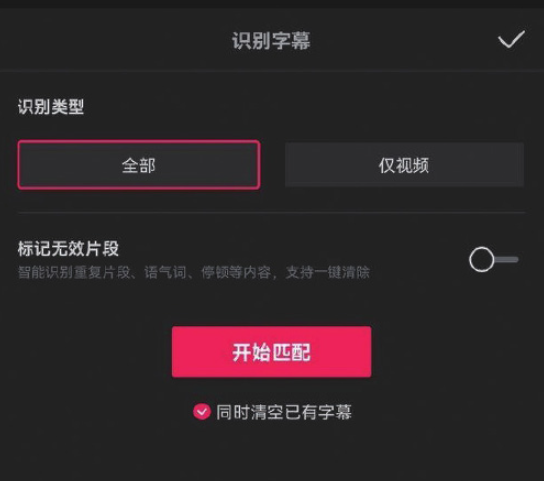
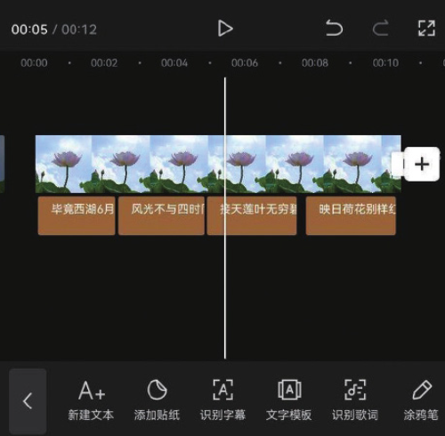

剪映内置的“识别字幕”功能可以对视频中的语言进行智能识别，然后将其自动转化为字幕。使用该功能可以快速且轻松地完成字幕的添加工作，达到节省工作时间的目的。

创建剪辑项目后，在未选中素材的状态下，点击底部工具栏中的“文字”按钮，在打开的文字选项栏中点击“识别字幕”按钮，如图 5-5 和图 5-6 所示。

在“识别字幕”选项栏中点击“开始匹配”按钮，如图 5-7 所示，等待片刻，识别完成后，时间轴中将自动生成文字素材，如图 5-8 所示。

