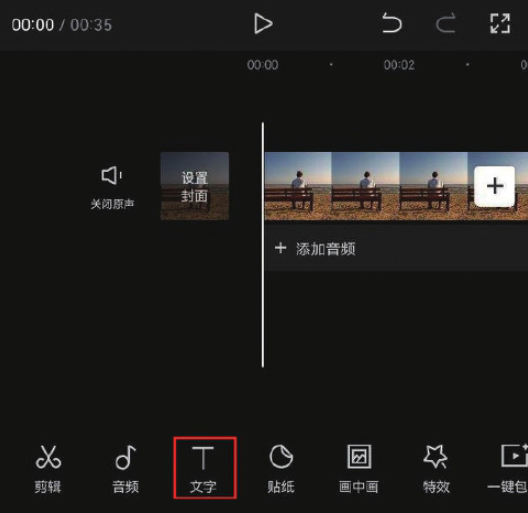
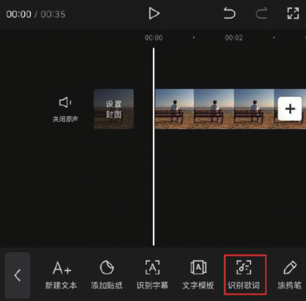
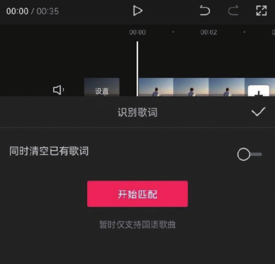
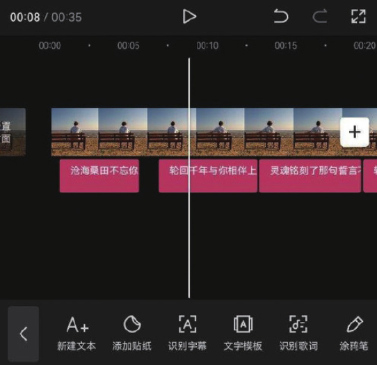

在剪辑项目中添加背景音乐后，使用“识别歌词”功能可以对音乐的歌词进行自动识别，并生成相应的文字素材，这对于一些想制作 MV 短片、卡拉 OK 视频效果的创作者来说，是非常省时省力的。

在剪辑项目中添加视频和音频素材后，在未选中素材的状态下，点击底部工具栏中的“文字”按钮，如图 5-9 所示。在打开的文字选项栏中点击“识别歌词”按钮，如图 5-10 所示。




在“识别歌词”选项栏中点击“开始匹配”按钮，如图 5-11 所示。等待片刻，识别完成后，时间轴中将自动生成多段文字素材，并且生成的文字素材将自动匹配至相应的时间点，如图 5-12 所示。




```
在识别人物台词时，如果人物说话的声音太小或者语速过快，会影响字幕自动识别的准确性。此外，在识别歌词时，受演唱时的发音影响，容易造成字幕出错。因此在完成字幕和歌词的自动识别工作后，一定要检查一遍，及时对错误的文字内容进行修改。
```
