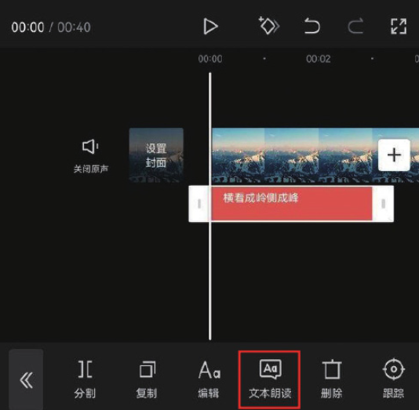
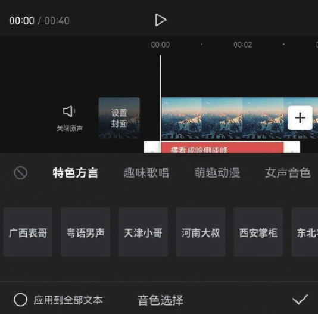
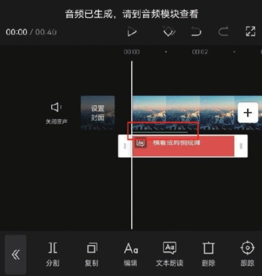

想必大家在刷抖音时经常会听到一些很有意思的声音，尤其是在一些搞笑类的视频中。有些人以为这些声音是为视频配音后再做变声处理得到的，其实没有那么麻烦，利用“文本朗读”功能就可以轻松实现。

在剪辑项目中添加文字素材后，选中文字素材，点击底部工具栏中的“文本朗读”按钮，如图 5-13 所示。在“音色选择”选项栏中可以看到有“特色方言”​“趣味歌唱”​“萌趣动漫”等不同选项，每个选项的选项栏中都有不同的声音效果，如图 5-14 所示。




可以根据实际需求选择合适的声音效果，点击某种声音效果时，可进行试听，如图 5-15 所示。试听完毕，点击右下角的按钮，时间轴中将自动生成语音，如图 5-16 所示。



```
生成的音频素材在时间轴中会以绿色线条的形式呈现，若要显示音频轨道，需在底部工具栏中点击“音频”按钮，切换至音频模块。
```
