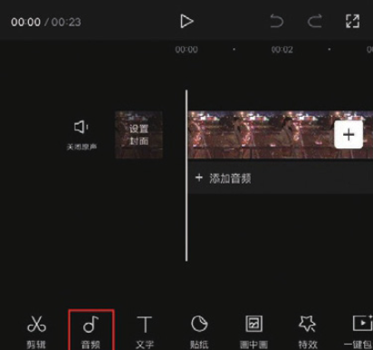
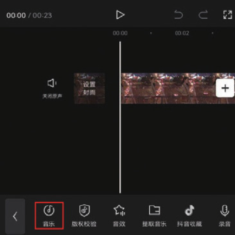
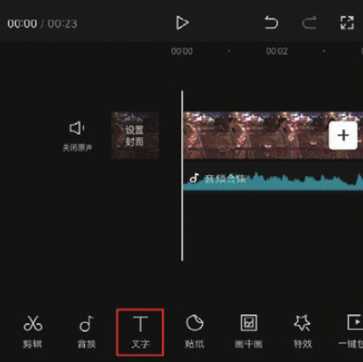
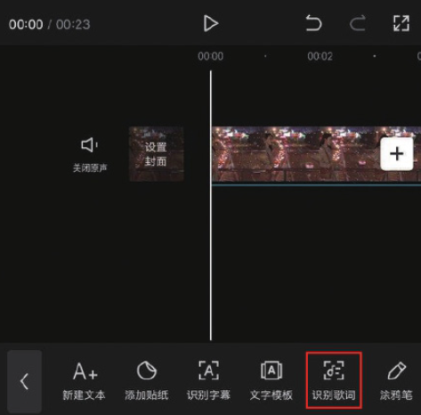
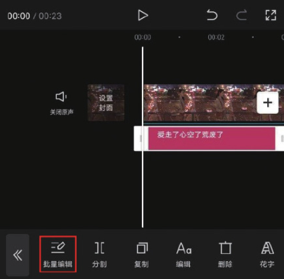

本案例介绍的是为视频添加歌词的操作方法，主要使用剪映的“音乐”和“识别歌词”功能。下面介绍具体的操作方法。

01 打开剪映 App，在主界面点击“开始创作”按钮，进入素材添加界面，选择一段背景视频素材，点击“添加”按钮，将素材添加至剪辑项目中。

02 进入视频编辑界面后，点击底部工具栏中的“音频”按钮，打开音频选项栏，点击其中的“音乐”按钮，如图 5-17 和图 5-18 所示。

03 进入剪映的音乐素材库，在“伤感”选项中选择图 5-19 所示的音乐，点击“使用”按钮，将其添加至剪辑项目中，在未选中任何素材的状态下，点击底部工具栏中的“文字”按钮，如图 5-20 所示。

04 在文字选项栏中点击“识别歌词”按钮，再在“识别歌词”选项栏中点击“开始匹配”按钮，如图 5-21 和图 5-22 所示。

05 等待片刻，识别完成后，时间轴中将自动生成歌词字幕，选中任意一段字幕，点击底部工具栏中的“批量编辑”按钮，如图 5-23 所示，进入编辑界面，对歌词进行审校，审校完成后点击按钮保存，如图 5-24 所示。

06 点击界面右上角的“导出”按钮，将视频保存至相册，效果如图 5-25 和图 5-26 所示。

