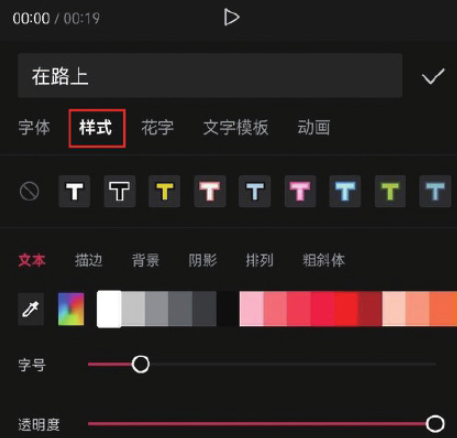
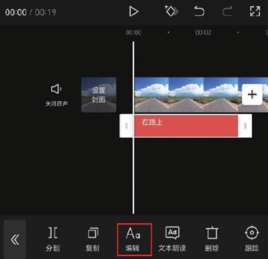
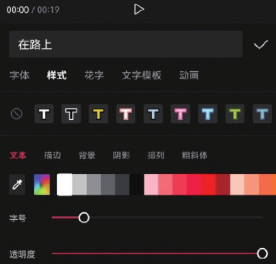

设置字幕样式的方法有两种，第一种是在创建字幕时，选择文本输入栏下方的“样式”选项，从而切换至字幕样式选项栏，如图 5-27 所示。

第二种方法，若在剪辑项目中已经创建了字幕，需要对文字的样式进行设置，则可以在时间轴中选中文字素材，然后点击底部工具栏中的“编辑”按钮，打开字幕样式选项栏，如图 5-28 和图 5-29 所示。

图 5-28 图 5-29 打开字幕样式选项栏后，可对文字的字体、颜色、描边、背景、阴影等属性进行设置。
