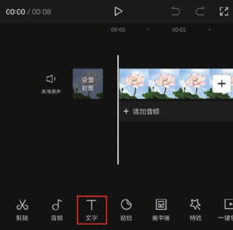
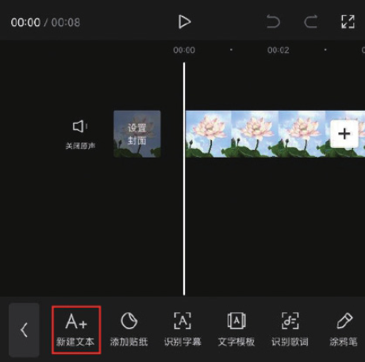
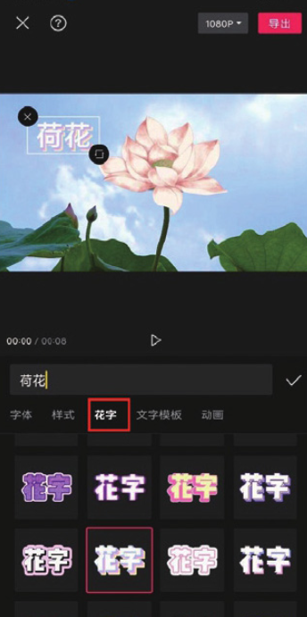

剪映内置了很多花字模板，可以一键制作出各种精彩的艺术字效果，其应用方法很简单。

在剪辑项目中添加视频素材后，点击底部工具栏中的“文字”按钮，打开文字选项栏，点击其中的“新建文本”按钮，如图 5-30 和图 5-31 所示。

在文本框中输入符合短视频主题的文字内容，在预览区按住文字素材并拖曳，调整好文字的位置，如图 5-32 所示。

选择文本输入栏下方的“花字”选项，从而切换至花字选项栏，选择需要的花字样式，即可快速让文字应用花字效果，如图 5-33 所示。

