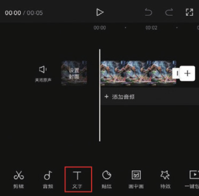
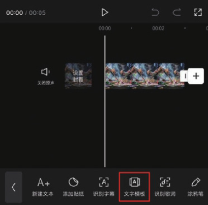
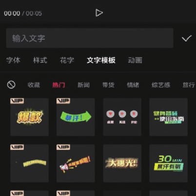
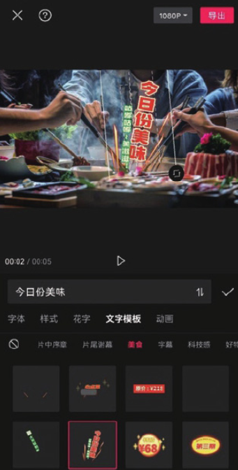

平时在刷短视频时，很多用户都会在视频中看到一些很有意思的字幕，如一些小贴士、小标签等，这些字幕可以在恰当的时刻很好地活跃视频的气氛，吸引观众，为视频画面大大增色。在剪映中，可以利用“文字模板”功能一键添加字幕。

在剪辑项目中添加视频素材后，点击底部工具栏中的“文字”按钮，打开文字选项栏，点击其中的“文字模板”按钮，如图 5-34 和图 5-35 所示。

打开模板选项栏，可以看到里面有新闻、带货、情绪、综艺感、旅行等不同类别的文字模板，如图 5-36 所示。用户可以根据自己的实际需求进行选择，在选项栏中选择任意一款字幕，即可将其添加至画面中，在预览区还可以调整字幕的大小和位置，如图 5-37 所示。

