本案例介绍的是综艺花字的制作方法，主要使用剪映的“花字”和“添加贴纸”功能。下面介绍具体的操作方法。

01 打开剪映 App，在主界面点击“开始创作”按钮，进入素材添加界面，选择一段背景视频素材，点击“添加”按钮，将素材添加至剪辑项目中。

02 进入视频编辑界面后，点击底部工具栏中的“文字”按钮，打开文字选项栏，点击其中的“新建文本”按钮，如图 5-38 和图 5-39 所示。

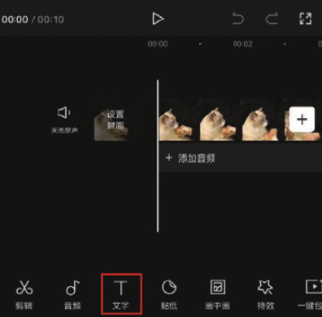
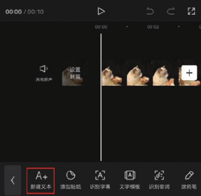

03 在文本框中输入需要添加的文字内容，选择文本框下方的“花字”选项，切换至花字选项栏，选择图 5-40 所示的花字样式，在预览区调整好文字的大小和位置，点击确认按钮保存，再点击底部工具栏中的返回按钮，如图 5-41 所示。

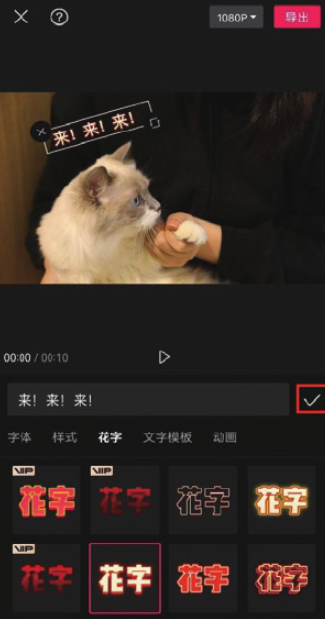
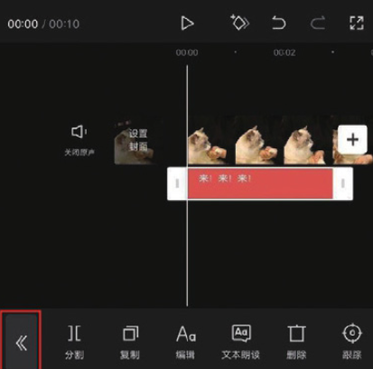

04 点击底部工具栏中的“添加贴纸”按钮，打开贴纸选项栏，在搜索框中输入关键词，点击键盘中的“搜索”按钮，如图 5-42 和图 5-43 所示。

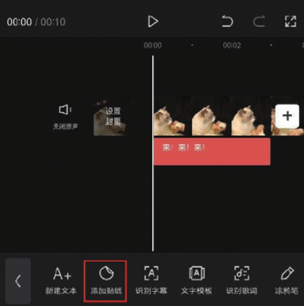

05 在搜索出的贴纸选项中选择图 5-44 所示的贴纸，并在预览区调整好贴纸的大小和位置。

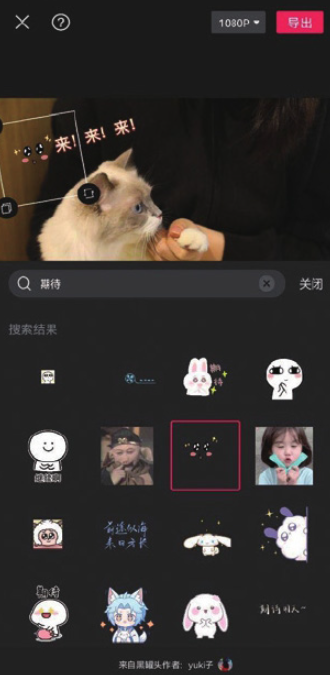

06 将时间线移动至文字素材和贴纸素材消失的位置，在时间轴中调整好字幕轨道和贴纸轨道的长度，如图 5-45 所示。

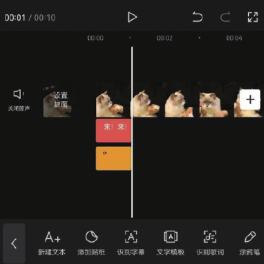

07 参照步骤 02 至步骤 06 的操作方法，根据视频的画面内容为视频添加其他的字幕和贴纸，如图 5-46 所示。将时间线移动至视频的起始位置，点击底部工具栏中的“音频”按钮，如图 5-47 所示。

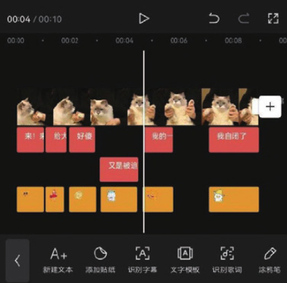
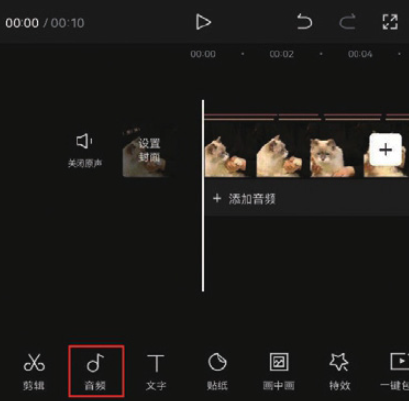

08 在音频选项栏中点击“音乐”按钮，如图 5-48 所示，进入剪映的音乐素材库，在“萌宠”选项中选择图 5-49 所示的音乐，点击“使用”按钮。

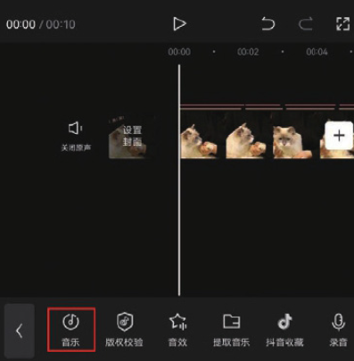

09 将时间线移动至视频的结尾处，选中音乐素材，点击底部工具栏中的“分割”按钮，再点击“删除”按钮，将多余的音乐素材删除，如图 5-50 和图 5-51 所示。

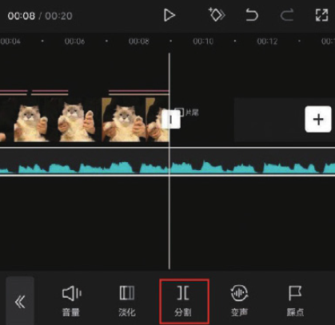
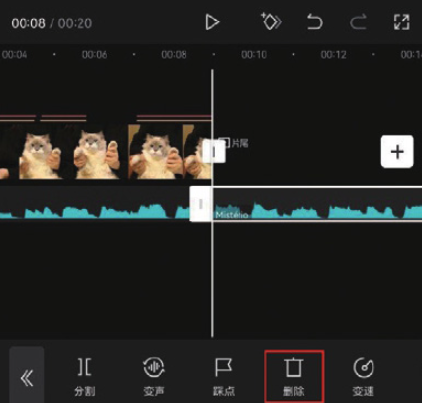

10 点击界面右上角的“导出”按钮，将视频保存至相册，效果如图 5-52 和图 5-53 所示。

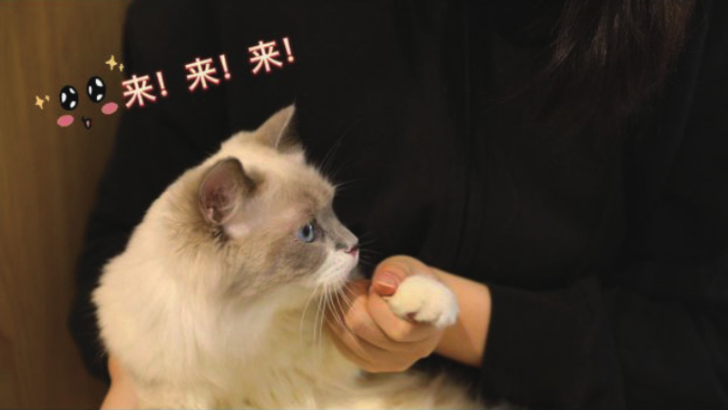

