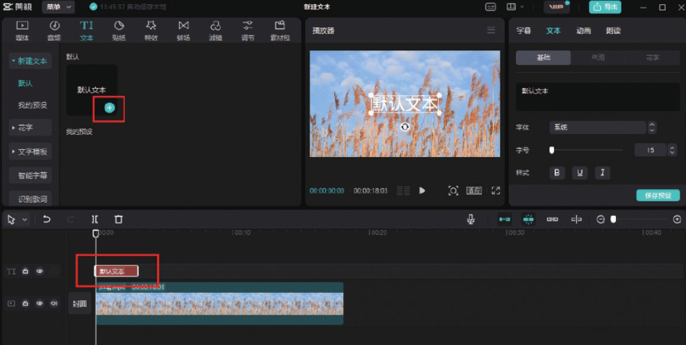
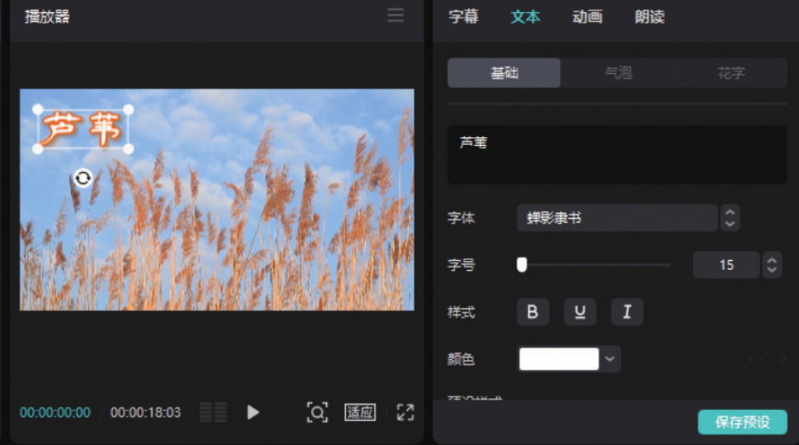

打开剪映专业版软件，在剪辑项目中添加视频素材并将其添加到时间轴中。然后在工具栏中单击“文本”按钮，在“新建文本”选项中单击“默认文本”右下角的“添加到轨道”按钮，即可在时间轴中添加一个文本轨道，而界面右上角的素材调整区会随之切换至“文本”功能区，如图 5-54 所示。

在“文本”功能区，用户可以在文本框中输入需要添加的文字内容，也可以自由设置文字的字体、颜色、描边、边框、阴影和排列方式等属性，以便制作出不同样式的文字效果。图 5-55 所示的字幕效果使用了“蝉影隶书”字体、橙色描边和阴影。

