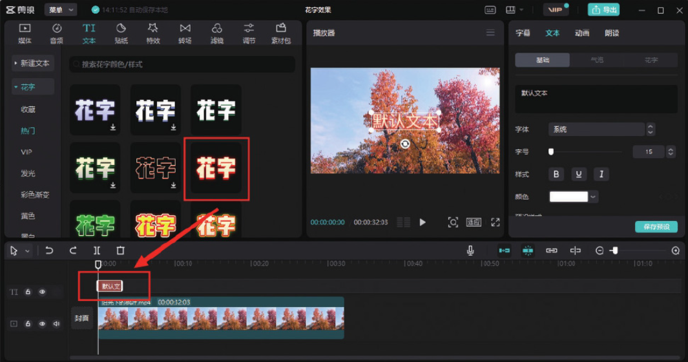
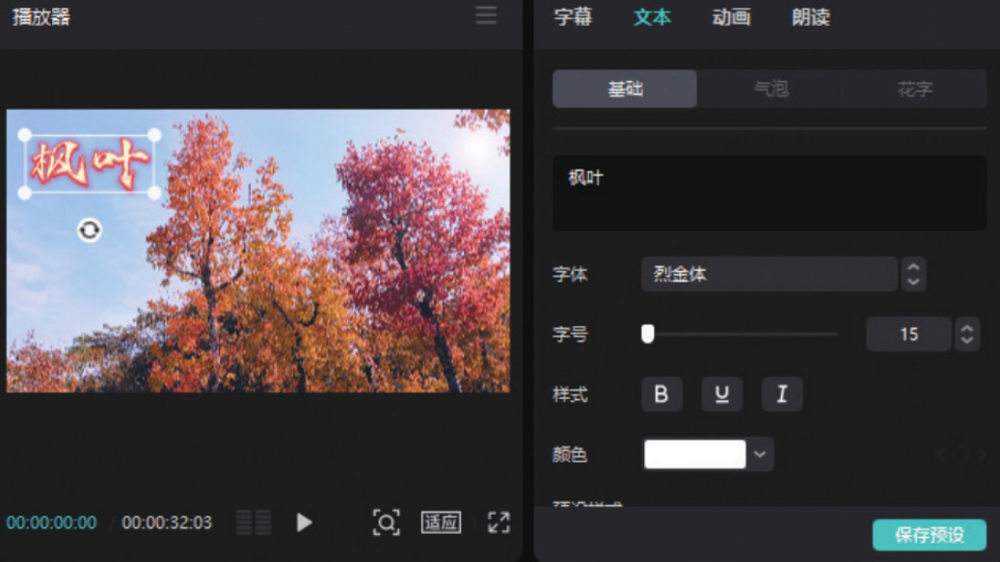

打开剪映专业版软件，在剪辑项目中添加视频素材并将其添加到时间轴中。然后在工具栏中单击“文本”按钮，在文本选项栏中单击“花字”按钮，打开花字选项栏，将其中任意一款花字样式拖入时间轴中，即可完成花字样式的调用，如图 5-56 所示。



时间轴中生成文本轨道后，用户可以在“文本”功能区的文本框中输入需要添加的文字内容，并设置其字体和大小等属性，图 5-57 所示的字幕效果使用了“烈金体”字体。



```
文字模板的应用方法与花字的应用方法一致，在文本选项栏中单击“文字模板”按钮，切换至文字模板选项栏，将其中任意一款文字模板拖入时间轴中，即可完成该模板的调用。
```
